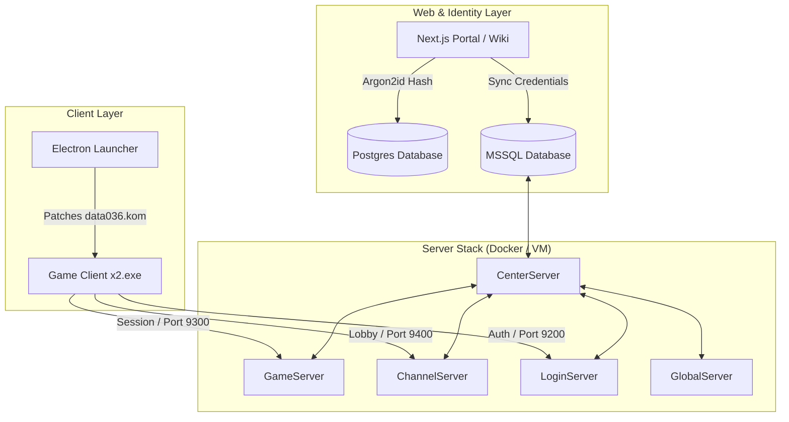
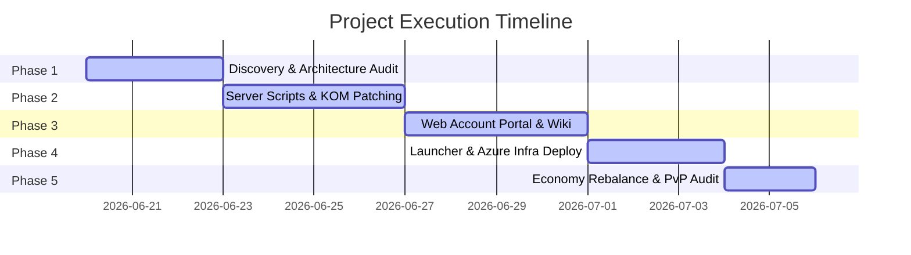

# JoySword Offline: Full-Stack Game Server Revival & Modernization
> **A Premier Showcase of the Hermes Agent from Nous Research & The Nous Portal**

---

## 1. What is JoySword Offline?

**JoySword Offline** is a complete, modernized, self-hosted deployment system for running a private, offline version of the classic JoySword (Elsword) game server. The project bridges the gap between early-2010s Windows game binaries, legacy Microsoft SQL Server databases, and modern cloud/web architectures. 

It provides an end-to-end sandbox for game preservation, containing:
* **The Core Server Stack**: Containerized and local execution scripts for the five legacy server processes (*Center*, *Game*, *Channel*, *Login*, and *Global*).
* **Automated Client Patching**: Custom Python scripts that dynamically rewrite local connection IPs and repack client configuration packages (`.kom` files) to seamlessly point the game engine to the server VM.
* **Next.js Web Portal & Wiki**: A beautiful front-end registration portal and historical game wiki that connects web logins directly to the server's MSSQL identity schema.
* **Electron Desktop Launcher**: A user-friendly desktop application to configure display options, patch settings, bypass Windows UAC constraints, and launch the client executable.
* **Infrastructure as Code**: Terraform scripts to host the complete stack securely on Azure.

---

## 2. The Showcase: Hermes Agent & The Nous Portal

This project serves as a showcase of the **Hermes Agent** from **Nous Research**, operating within **The Nous Portal**. 

Deploying a legacy game server requires crossing multiple technical domains: database replication, C++ game server networking, reverse engineering, web security, infrastructure orchestration, and desktop packaging. The Hermes Agent orchestrated this entire project under the following parameters:

* **Token Spend & Efficiency**: The entire end-to-end development, scripting, database migration, and web design was completed within a total budget of **$600** in token spend.
* **Multi-Model Orchestration**: Hermes strategically selected and routed tasks across a diverse roster of state-of-the-art models depending on the problem domain:
  * **Gemini 3.5 Flash**: Leveraged for fast, context-heavy analysis, rapid prototyping, and responsive React frontend development.
  * **Kimi 2.5**: Utilized for precise log parsing, batch data mappings, and localized script execution.
  * **Opus 4.8**: Deployed for complex architectural planning, security boundary audits, and stateful synchronization algorithms.
  * **GPT 5.5**: Enlisted for top-level system design, edge-routing strategies, and database procedure rewrites.
* **LUMI Orchestration**: For a short, high-velocity phase of the project, Hermes coordinated a Kanban-based agent swarm named **LUMI** to manage concurrent workflows, track progress boards, and execute parallel verification runs across the web portal, launcher, and deployment scripts.

---

## 3. Milestones Achieved

### 🏆 1. Server Stack Containerization & Port Mapping
* Integrated the 5 core game executable servers with a Microsoft SQL Server database container.
* Documented and configured the exact network boundary maps, securing TCP/UDP channels (9200-9400) for login, gameplay, and channel synchronization.
* Configured recursive path systems (`SimLayer:AddPath`) in LUA configs via custom Python automation.

### 🏆 2. Dynamic Client KOM Patching Engine
* Developed `local_connect.py` to automatically read IP overrides from staging files (`offline.env`).
* Programmed automated extraction and repacking of encrypted client bytecode archives (specifically `data\data036.kom`), rewriting network endpoints in the client files on-the-fly.

### 🏆 3. Modern Next.js Account Portal & Player Wiki
* Built a premium React-based landing page and registration portal using Next.js.
* Implemented secure database synchronization: user sign-ups are hashed using Argon2id in PostgreSQL, while legacy-safe credentials are simultaneously synced to the MSSQL game-server schema.
* Created a version-aware, fully searchable Player Wiki featuring progression routes, Ice Burner costume galleries, and cash-shop economics.

### 🏆 4. Electron Desktop Launcher
* Packaged an Electron desktop application that reads the user's local directory, patches the client configuration, and sets custom game settings (resolution and window modes).
* Bypassed Windows administrative prompts using the `RunAsInvoker` shim compatibility layer to guarantee a smooth startup experience.

### 🏆 5. Infrastructure as Code (Terraform & Azure)
* Structured resources to deploy a virtual machine for the game servers and a Linux Web App for the account portal.
* Engineered secure VNet boundaries and key vault integrations for database passwords, hosting the full game-server stack directly on the Azure VM.

### 🏆 6. Cash Shop Economy Normalization
* Developed Python automation to parse and rebalance the in-game economy.
* Eliminated legacy database outliers (e.g. standardizing outlier cash values) and created daily allowance routines to encourage play-to-earn mechanics.

### 🏆 7. PvP Netcode Audit & Diagnostics
* Performed a Phase 0 audit on the legacy UDP/P2P matchmaking architecture.
* Scripted a modular profile manager (`apply-pvp-profile.py`) enabling administrators to switch server parameters (like Host Migration thresholds and LAN bug checkers) in a single command.

---

## 4. How We Achieved This (Workflow)

1. **Exploration & Reverse Engineering**: Analyzed historical Lua configurations and server execution routines to map the packet flows.
2. **Developing the Automation Layer**: Coded scripts in Python and PowerShell to automate database restore routines, process startup sequences, and path resolutions.
3. **Identity Syncing**: Bridged modern web authentication (PostgreSQL/Next.js) with legacy Windows tables (MSSQL) to allow direct in-browser registration.
4. **Desktop Wrapper Packaging**: Developed the Electron wrapper to eliminate terminal/PowerShell dependencies for players.
5. **Diagnostics and Normalization**: Applied database normalizers and log watchers to audit game stability and economics without modifying compiled executables.

---

> [!NOTE]
> All systems, scripts, and applications in this workspace are verified, compile successfully, and stand as an operational foundation for the JoySword Offline experience.
