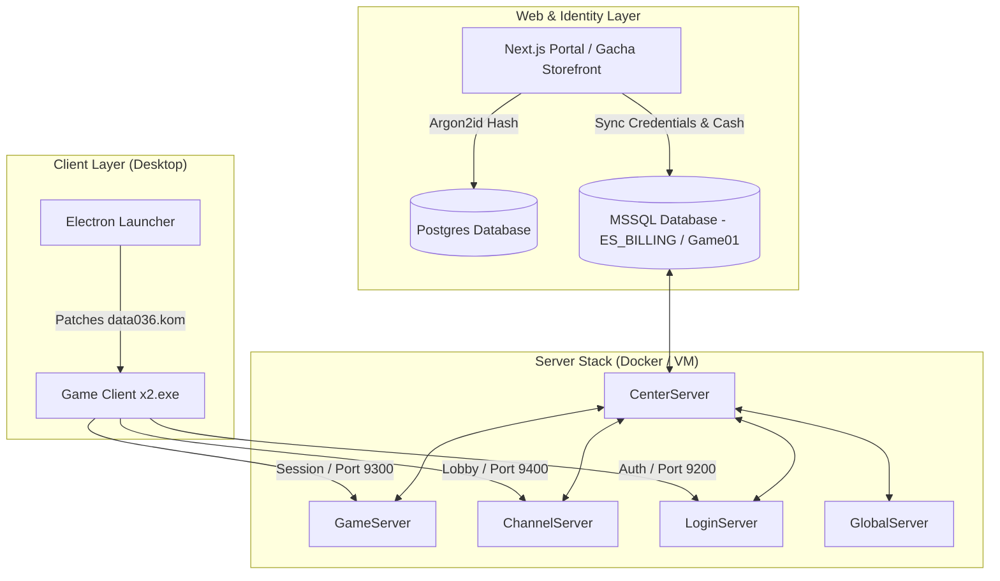

# JoySword Online

<div align="center">
  <p align="center">
    
  </p>
  
  <h3>The self-hosted, modernized game preservation stack for JoySword (Elsword).</h3>
  
  <p align="center">
    
    
    
    
    
  </p>

  <p align="center">
    <a href="#🚀-quick-start-guide"><b>Quick Start</b></a> •
    <a href="#📐-architecture-overview"><b>Architecture</b></a> •
    <a href="#⚡-features"><b>Features</b></a> •
    <a href="#📖-documentation-index"><b>Documentation</b></a> •
    <a href="#🩺-quick-troubleshooting"><b>Troubleshooting</b></a> •
    <a href="#🤖-showcase-background"><b>Agentic Showcase</b></a>
  </p>

  <sub>Built for developers, gaming historians, and private server administrators.</sub>
</div>

---

## ⚡ Features

* **⚡ Core Server Stack**: Local or containerized execution of the five legacy server executables (*Center, Game, Channel, Login, Global*) bundled with an optimized SQL Server database (`ES_BILLING`, `Game01`, `Account`).
* **💎 Modern CashShop & Gacha Economy Engine**:
  * **100% Item Coverage**: 17,042+ catalog items normalized into F2P-friendly price tiers across `CashItemPrice.lua` and `ES_BILLING.dbo.EB_Product`.
  * **Server-Side Price Validation**: `EBP_BuyItem` dynamically validates unit price x quantity against database product tables and logs positive transaction values.
  * **2x First Top-Up Bonus**: 100% cash bonus on first purchase across 6 USD tiers ($0.99 to $99.99).
  * **10% Starlight Cashback**: Earn 10% Starlight Tokens on all cash purchases, redeemable for endgame Lv.11 & Lv.12 Magic Amulets and prestige cosmetics.
  * **15-Tier VIP Loyalty & Paragon Pass**: Includes 15 VIP tiers with ED multipliers, fee discounts, monthly Ice Burner stipends, and a 50-tier Paragon Battle Pass.
* **🛡️ Identity Sync Engine**: Bridges modern user authentication (Argon2id hashing via Next.js + SQL) directly with legacy game database structures in real-time.
* **🎮 Master Economy Balance**: Zero enhancement destruction (0% Break / 0% DownTo0 on Lv.1–12), 5x field boss drop scaling, authentic Gacha rates (0.8% SSR) + 200 Token Pity Crafting exchange, and modern Echo NPC Shop items.
* **🔌 Dynamic Client Patching**: Custom Python algorithms to dynamically override client IP routing tables and repack `.kom` bytecode packages (`data036.kom`) on startup.
* **💻 Electron Desktop Launcher**: A ready-to-run Windows client wrapper that applies resolutions, launches processes, and bypasses UAC flags using shims.
* **☁️ Infrastructure as Code**: Terraform configurations to deploy the entire environment securely to Azure VMs with VNet-isolated networking.

---

## 📐 Architecture Overview



---

## NPC PvP Intelligence V7

JoySword includes a runtime-grounded competitive cognition system for all ten Hero NPC PvP profiles (Amelia, Apple, Balak, Edan, Lime, Low, Noa, Penensio, Q-PROTO_00, Spika). V6 supplies persistent match strategy, exchange plans, and adaptive defense, while V7 verifies how actions pass through the legacy engine.

The V7 execution path separates decision, action request, engine start, combat result, and attributed learning:

```text
decision -> action request -> engine start -> combat result -> attributed learning
```

Key improvements include:
* A shared 48-signal contract distinguishing direct, derived, heuristic, and unverified runtime information.
* Expiring observations with source, confidence, and action attribution.
* Bounded action lifecycles for contact, damage, block/armor, whiff, interruption, and recovery.
* Character-specific timing, range, pacing, defense, and resource calibration across all 10 Hero NPCs.

Read the [companion brief](docs/PVP_AI_V7_COMPANION_BRIEF.md) for the concise overview, [implementation strategy](docs/PVP_AI_V7_STRATEGY.md) for rollout guidance, [design philosophy](docs/PVP_AI_V7_DESIGN_PHILOSOPHY.md) for fairness principles, and [technical whitepaper](docs/PVP_AI_V7_WHITEPAPER.md) for architecture.

---

## 📁 Repository Structure

| Component | Path | Description |
| :--- | :--- | :--- |
| 🎮 **Server** | [`Elsword/`](file:///c:/Users/media/Downloads/JoySwordOffline/Elsword) | Executable files, log configurations, Lua price files, and database backups. |
| 🌐 **Portal** | [`web/`](file:///c:/Users/media/Downloads/JoySwordOffline/web) | Next.js authentication portal, Gacha Storefront, and searchable wiki. |
| 💻 **Launcher** | [`launcher/`](file:///c:/Users/media/Downloads/JoySwordOffline/launcher) | Desktop Electron app codebase. |
| ⚙️ **Client** | [`client/`](file:///c:/Users/media/Downloads/JoySwordOffline/client) | Windows client scripts, patches, and launchers. |
| 🗄️ **Database** | [`database/`](file:///c:/Users/media/Downloads/JoySwordOffline/database) | MSSQL routines, cash deduction procedures, VIP policies, and restoration SQL scripts. |
| ☁️ **Infra** | [`infra/`](file:///c:/Users/media/Downloads/JoySwordOffline/infra) | Azure VM and network deployment scripts. |
| 🛠️ **Scripts** | [`scripts/`](file:///c:/Users/media/Downloads/JoySwordOffline/scripts) | Python automation for cash shop rebalancing, database healthchecks, and billing audits. |
| 🧪 **Tests** | [`tests/`](file:///c:/Users/media/Downloads/JoySwordOffline/tests) | Master economy unit test suite (`test-master-economy.py`). |

---

## 🚀 Quick Start Guide

### 📋 Prerequisites
* **Node.js** (v18.x or v20.x recommended)
* **Python** (v3.10+ recommended)
* **Microsoft SQL Server** / **Docker** (for local server execution)

### ⚙️ 1. Environment Configuration
Before launching services, copy the environment templates and insert your local or staging variables:
* **Root Settings**: Copy `.env.example` to `.env` in the root folder.
* **Web Settings**: Copy `web/.env.example` to `web/.env`.
* **Server Settings**: Copy `Elsword/offline/offline.env.example` to `Elsword/offline/offline.env`.

### 🌐 2. Start the Account & Gacha Portal
Spin up the Next.js frontend and API route handlers:
```bash
cd web
npm install
npm run dev
```
Access the portal and Gacha Storefront at `http://localhost:3000`.

### 💻 3. Run the Electron Desktop Launcher
Compile and boot the Electron wrapper client:
```bash
cd launcher
npm install
npm run dev
```

### 🎮 4. Initialize Server Stack & Economy
Bootstrap database procedures, normalize cash shop prices, and sequence server process boot orders:
```powershell
# Restore cash shop items and normalize pricing across Lua files & DB
python scripts/rebalance-cashshop-economy.py --apply
python scripts/restore-cashshop.py

# Launch server stack
.\Start-Server-Automatic.ps1
```

### 🧪 5. Verification & Health Audits
Run automated test suites and billing audits to verify system integrity:
```bash
# Run Master Economy 30-Test Suite
python tests/test-master-economy.py

# Verify Cash Deduction & Top-Up Flow
python scripts/verify-cash-deduction-flow.py

# Run Live Database Billing Audit
python scripts/audit-billing.py
```

---

## 📖 Documentation Index

| Guide | Description |
| :--- | :--- |
| **[NPC PvP Intelligence V7 Companion Brief](docs/PVP_AI_V7_COMPANION_BRIEF.md)** | Concise summary of the runtime-grounding milestone, evidence, limitations, and recommended next step. |
| **[NPC PvP Intelligence V7 Strategy](docs/PVP_AI_V7_STRATEGY.md)** | Implementation, calibration, change-control, and live-testing strategy for all ten Hero NPC profiles. |
| **[NPC PvP Intelligence V7 Design Philosophy](docs/PVP_AI_V7_DESIGN_PHILOSOPHY.md)** | Principles for believable high-skill behavior, uncertainty, fairness, identity, bounded adaptation, and anti-cheating. |
| **[NPC PvP Intelligence V7 Whitepaper](docs/PVP_AI_V7_WHITEPAPER.md)** | Technical architecture, signal contract, confirmation lifecycle, harness methodology, exact offline results, and evidence boundaries. |
| **[Local Public Hosting Recovery](docs/LOCAL_PUBLIC_HOSTING_RECOVERY.md)** | Home-router port forwarding, Windows network recovery, and local public-host troubleshooting. |
| 🚀 [**Deployment Guide**](deployment_guide.md) | Setting up the game stack locally or on an Azure Virtual Machine. |
| 🔌 [**Connection Guide**](CLIENT_CONNECTION_GUIDE.md) | Client patching protocols, IP overrides, and launcher configuration details. |
| 👑 [**Admin Guide**](ADMIN_GUIDE.md) | Database triggers, rebalancing cash shops, and scheduler configurations. |
| 🩺 [**Troubleshooting Guide**](troubleshooting_guide.md) | Network port mapping boundaries, log audits, and diagnostic runs. |
| 📝 [**Operations Details**](docs/README.md) | API structures, SQL schemas, and network routing boundaries. |

---

## 🩺 Quick Troubleshooting

> [!TIP]
> Use these quick checks for common setup and deployment hurdles.

### 🔌 Client Cannot Connect / Login Hangs
Ensure game client sockets use **direct IPv4 only** (`52.238.194.187`). Hostnames are supported for HTTP/web APIs, but are unsupported for client game connections. Check Azure NSG rules and verify Windows Firewall is permitting inbound traffic on TCP ports `9200`, `9300`, and `9400`.

### 💎 Cash Shop Buy Fails In-Game
If item purchases fail or return an error, ensure that `rebalance-cashshop-economy.py --apply` has been executed to update `CashItemPrice.lua` in both `ServerResource` and `GameServer` directories, and that `restore-cashshop.py` has updated `ES_BILLING.dbo.EB_Product`. Run `python scripts/audit-billing.py` to confirm.

### 🗄️ Account Enters Login but Fails Channel Selection
If user verification succeeds but entering a channel fails with a server log of `GetUID() : 0`, the account was created without its SQL provisioning tables. Use the database repair utility to resolve this:
```powershell
python scripts/repair-account-init.py
```

### 🌐 Web Registration Portal Returns 503
If the API is healthy but registration fails, verify that database access is not being blocked. A common issue is a Windows Firewall rule `JoySword SQL inbound deny` blocking SQL Server port `1433` even if VNet routes are configured correctly.

---

## 🤖 Showcase Background

This repository stands as an automated system integration showcase for **Nous Research's Hermes Agent** operating inside **The Nous Portal**.

* **Token Optimization**: Orchestrated across diverse architectures using a total token budget of **$600**.
* **Multi-Model Routing**: Hermes divided system tasks between specialized models:
  * **Gemini 3.5 Flash** for rapid prototyping, logs parsing, and React development.
  * **Kimi 2.5** for parsing structured configurations and executing data steps.
  * **Opus 4.8** for network auditing and security boundaries.
  * **GPT 5.5** for top-level service configurations and database schema migrations.
* **LUMI Swarm**: Utilized a Kanban-based agent swarm to orchestrate simultaneous validation testing across web portals, client setup, and launcher builds.

---

## 📜 License
JoySword Online is created for educational, historical, and software archival purposes. Distributed under the MIT License.
