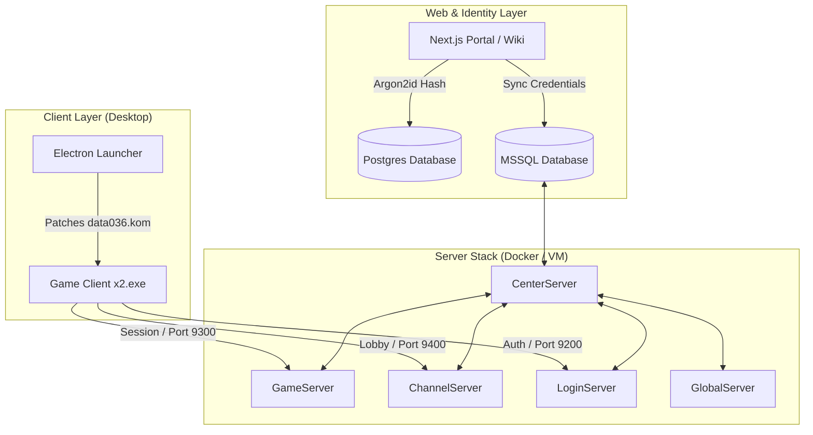

# JoySword Online

<div align="center">
  <p align="center">
    
  </p>
  
  <h3>The self-hosted, modernized game preservation stack for JoySword (Elsword).</h3>
  
  <p align="center">
    
    
    
    
    
  </p>

  <p align="center">
    <a href="#🚀-quick-start-guide"><b>Quick Start</b></a> •
    <a href="#📐-architecture-overview"><b>Architecture</b></a> •
    <a href="#⚡-features"><b>Features</b></a> •
    <a href="#📖-documentation-index"><b>Documentation</b></a> •
    <a href="#🩺-quick-troubleshooting"><b>Troubleshooting</b></a> •
    <a href="#🤖-showcase-background"><b>Agentic Showcase</b></a>
  </p>

  <sub>Built for developers, gaming historians, and private server administrators.</sub>
</div>

---

## ⚡ Features

* **⚡ Core Server Stack**: Local or containerized execution of the five legacy server executables (*Center, Game, Channel, Login, Global*) bundled with an optimized SQL Server database.
* **🛡️ Identity Sync Engine**: Bridges modern user authentication (Argon2id hashing via Next.js + PostgreSQL) directly with legacy game database structures (MSSQL) in real-time.
* **🔌 Dynamic Client Patching**: Custom Python algorithms to dynamically override client IP routing tables and repack `.kom` bytecode packages (`data036.kom`) on startup.
* **💻 Electron Desktop Launcher**: A ready-to-run Windows client wrapper that applies resolutions, launches processes, and bypasses UAC flags using shims.
* **☁️ Infrastructure as Code**: Terraform configurations to deploy the entire environment securely to Azure VMs with VNet-isolated networking.
* **📊 Economy Rebalancer**: Scripted tooling to audit, normalize, and scale in-game currency flows, cash shop lists, and costume unlock mechanics.

---

## 📐 Architecture Overview



---

## 📁 Repository Structure

| Component | Path | Description |
| :--- | :--- | :--- |
| 🎮 **Server** | [`Elsword/`](file:///c:/Users/media/Downloads/JoySwordOffline/Elsword) | Executable files, log configurations, and database backups. |
| 🌐 **Portal** | [`web/`](file:///c:/Users/media/Downloads/JoySwordOffline/web) | Next.js authentication portal, site files, and searchable wiki. |
| 💻 **Launcher** | [`launcher/`](file:///c:/Users/media/Downloads/JoySwordOffline/launcher) | Desktop Electron app codebase. |
| ⚙️ **Client** | [`client/`](file:///c:/Users/media/Downloads/JoySwordOffline/client) | Windows client scripts, patches, and launchers. |
| 🗄️ **Database** | [`database/`](file:///c:/Users/media/Downloads/JoySwordOffline/database) | MSSQL routines, cash-allowance structures, and SQL audits. |
| ☁️ **Infra** | [`infra/`](file:///c:/Users/media/Downloads/JoySwordOffline/infra) | Azure VM and network deployment scripts. |
| 🛠️ **Scripts** | [`scripts/`](file:///c:/Users/media/Downloads/JoySwordOffline/scripts) | PowerShell & Python tasks for patches, audits, and configuration. |
| 🧪 **Tests** | [`tests/`](file:///c:/Users/media/Downloads/JoySwordOffline/tests) | Validation checks for database connection configurations. |

---

## 🚀 Quick Start Guide

### 📋 Prerequisites
* **Node.js** (v18.x or v20.x recommended)
* **Python** (v3.10+ recommended)
* **Microsoft SQL Server** / **PostgreSQL** (for local runs)

### ⚙️ 1. Environment Configuration
Before launching services, copy the environment templates and insert your local or staging variables:
* **Root Settings**: Copy `.env.example` to `.env` in the root folder.
* **Web Settings**: Copy `web/.env.example` to `web/.env`.
* **Server Settings**: Copy `Elsword/offline/offline.env.example` to `Elsword/offline/offline.env`.

### 🌐 2. Start the Account Portal
Spin up the Next.js frontend and registration API:
```bash
cd web
npm install
npm run dev
```
Access the portal at `http://localhost:3000`.

### 💻 3. Run the Electron Desktop Launcher
Compile and boot the Electron wrapper client:
```bash
cd launcher
npm install
npm run dev
```

### 🎮 4. Initialize Server Executables (Windows / VM)
Bootstrap database procedures, adjust firewall rules, and sequence server process boot orders:
```powershell
.\Start-Server-Automatic.ps1
```

---

## 📖 Documentation Index

| Guide | Description |
| :--- | :--- |
| **[Local Public Hosting Recovery](docs/LOCAL_PUBLIC_HOSTING_RECOVERY.md)** | Home-router port forwarding, Windows network recovery, and local public-host troubleshooting. |
| 🚀 [**Deployment Guide**](deployment_guide.md) | Setting up the game stack locally or on an Azure Virtual Machine. |
| 🔌 [**Connection Guide**](CLIENT_CONNECTION_GUIDE.md) | Client patching protocols, IP overrides, and launcher configuration details. |
| 👑 [**Admin Guide**](ADMIN_GUIDE.md) | Database triggers, rebalancing cash shops, and scheduler configurations. |
| 🩺 [**Troubleshooting Guide**](troubleshooting_guide.md) | Network port mapping boundaries, log audits, and diagnostic runs. |
| 📝 [**Operations Details**](docs/README.md) | API structures, SQL schemas, and network routing boundaries. |

---

## 🩺 Quick Troubleshooting

> [!TIP]
> Use these quick checks for common setup and deployment hurdles.

### 🔌 Client Cannot Connect / Login Hangs
Ensure game client sockets use **direct IPv4 only** (`52.238.194.187`). Hostnames are supported for HTTP/web APIs, but are unsupported for client game connections. Check Azure NSG rules and verify Windows Firewall is permitting inbound traffic on TCP ports `9200`, `9300`, and `9400`.

### 🗄️ Account Enters Login but Fails Channel Selection
If user verification succeeds but entering a channel fails with a server log of `GetUID() : 0`, the account was created without its SQL provisioning tables. Use the database repair utility to resolve this:
```powershell
python scripts/repair-account-init.py
```

### 🌐 Web Registration Portal Returns 503
If the API is healthy but registration fails, verify that database access is not being blocked. A common issue is a Windows Firewall rule `JoySword SQL inbound deny` blocking SQL Server port `1433` even if VNet routes are configured correctly.

---

## 🤖 Showcase Background

This repository stands as an automated system integration showcase for **Nous Research's Hermes Agent** operating inside **The Nous Portal**.

* **Token Optimization**: Orchestrated across diverse architectures using a total token budget of **$600**.
* **Multi-Model Routing**: Hermes divided system tasks between specialized models:
  * **Gemini 3.5 Flash** for rapid prototyping, logs parsing, and React development.
  * **Kimi 2.5** for parsing structured configurations and executing data steps.
  * **Opus 4.8** for network auditing and security boundaries.
  * **GPT 5.5** for top-level service configurations and database schema migrations.
* **LUMI Swarm**: Utilized a Kanban-based agent swarm to orchestrate simultaneous validation testing across web portals, client setup, and launcher builds.

---

<div align="center">
  <sub>JoySword Online is created for educational, historical, and software archival purposes.</sub>
</div>
