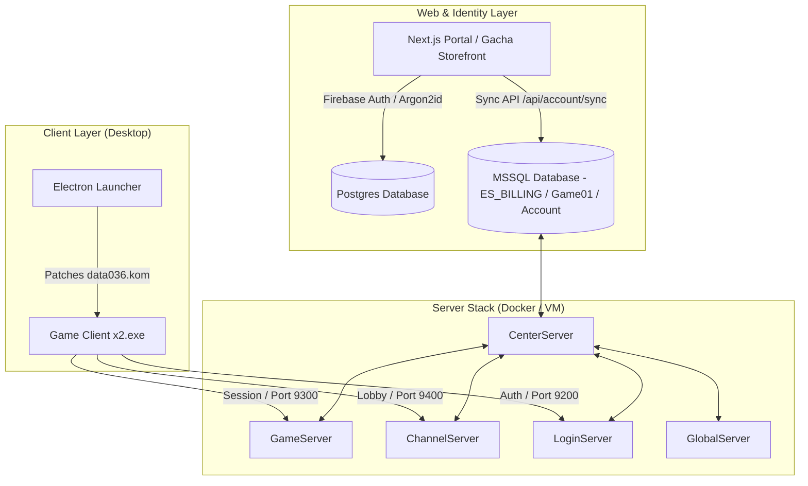
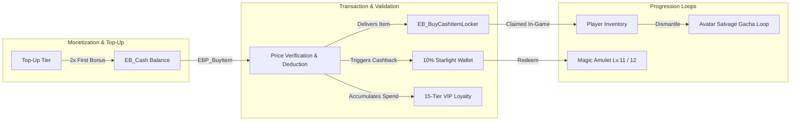
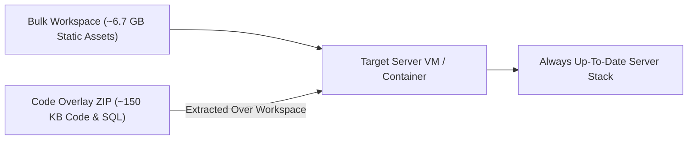
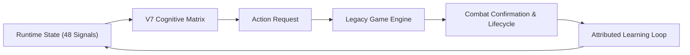

# JoySword Online

<div align="center">
  <p align="center">
    
  </p>
  
  <h3>The self-hosted, modernized game preservation stack for JoySword (Elsword).</h3>
  
  <p align="center">
    
    
    
    
    
    
    
    
    
    
  </p>

  <p align="center">
    <a href="#🚀-quick-start-guide"><b>Quick Start</b></a> •
    <a href="#📐-architecture--network-boundary-map"><b>Architecture & Ports</b></a> •
    <a href="#⚡-features"><b>Features</b></a> •
    <a href="#🛡️-sovereign-sre--high-throughput-db-architecture"><b>SRE & DB Architecture</b></a> •
    <a href="#💎-master-economy--gacha-architecture"><b>Master Economy</b></a> •
    <a href="#⚡-monetization--progression-database-suite"><b>Monetization DB Suite</b></a> •
    <a href="#⚔️-npc-pvp-intelligence-v7"><b>PvP AI V7</b></a> •
    <a href="#🧪-test--verification-suites"><b>Test Suites</b></a> •
    <a href="#🛠️-cli-utilities--operator-reference"><b>CLI Reference</b></a> •
    <a href="#📖-documentation-index"><b>Documentation</b></a> •
    <a href="#🩺-quick-troubleshooting"><b>Troubleshooting</b></a>
  </p>

  <sub>Built for developers, gaming historians, and private server administrators.</sub>
</div>

---

## 🎯 Stakeholder Onboarding Guide

Welcome to **JoySword Online**. Depending on your role, use the targeted onboarding pathways below to navigate the codebase, setup your environment, and manage server components effectively:

| Stakeholder Persona | Primary Focus & Goal | Recommended Onboarding Steps | Core Documentation |
| :--- | :--- | :--- | :--- |
| **🛠️ Server Operators & Admins** | 1-Click local server launch, process monitoring, firewall rules | 1. Run `.\Start-Server-Automatic.ps1` to launch all 5 server executables.<br>2. Execute `powershell -ExecutionPolicy Bypass -File .\scripts\ensure-game-firewall.ps1` for ports.<br>3. Monitor self-healing logs in `logs/server-supervisor.log`. | [Quick Start Guide](#🚀-quick-start-guide)<br>[Self-Healing Supervisor](#1-100-self-healing-process-supervisor) |
| **💻 Client Devs & Modders** | Desktop launcher, KOM client archive patching, Code Overlays | 1. Run `python scripts/patch-client-kom.py` to configure IP overrides.<br>2. Execute `powershell -ExecutionPolicy Bypass -File .\Start-Client-Windows.ps1` to launch Electron UI.<br>3. Build overlays via `python scripts/build-code-overlay.py`. | [Code Overlay Engine](#🔥-code-overlay--hot-patching-engine)<br>[Dynamic Client Patching](#🔌-dynamic-client-patching) |
| **🛡️ SRE & Database Engineers** | Lockless RCSI concurrency, 50-thread pool scaling, TempDB 4-file tuning | 1. Apply storage engine fixes via `python scripts/db-optimize-storage.py`.<br>2. Run strategy benchmarks via `python scripts/benchmark-strategy.py`.<br>3. Verify offline profile via `python scripts/verify-offline.py`. | [SRE & DB Architecture](#🛡️-sovereign-sre--high-throughput-db-architecture)<br>[Benchmark Report](file:///C:/Users/media/.gemini/antigravity-ide/brain/092f37d0-4053-47e3-a058-a0fffa8deff8/channel_connection_benchmark_results.md) |
| **💎 Game Designers & Economy** | CashShop catalog pricing, 0% RNG destruction, VIP/BattlePass balance | 1. Inspect F2P catalog in `Elsword/ServerResource/CashItemPrice.lua`.<br>2. Review 0% destruction tables in `Elsword/ServerResource/EnchantTable.lua`.<br>3. Audit VIP tiers in `database/install-vip-tier-system.sql`. | [Master Economy](#💎-master-economy--gacha-architecture)<br>[PvP AI V7](#⚔️-grounded-npc-pvp-ai-v7-engine) |

---

## ✅ 5-Minute Developer & Operator Onboarding Checklist

Follow this checklist to verify your environment readiness in under 5 minutes:

- [ ] **Step 1: Automated Preflight Audit**: Run `python scripts/onboard-environment.py` to audit Python dependencies, Lua configurations, DSN buffers, and unit tests.
- [ ] **Step 2: Database Storage Engine Tuning**: Execute `python scripts/db-optimize-storage.py` to enable Read-Committed Snapshot Isolation (RCSI), TempDB 4-file allocation, and forced delayed durability.
- [ ] **Step 3: Firewall & Port Rules**: Run `powershell -ExecutionPolicy Bypass -File .\scripts\ensure-game-firewall.ps1` to unblock server ports 9100–9500.
- [ ] **Step 4: 1-Click Server Startup**: Execute `.\Start-Server-Automatic.ps1` to launch all 5 server executables alongside the 100% self-healing supervisor.
- [ ] **Step 5: Client Connection Test**: Execute `.\Start-Client-Windows.ps1` to launch the Electron desktop client and verify channel login.

---

## 📋 System Requirements & Prerequisites Matrix

| Component | Minimum Specification | Recommended Specification |
| :--- | :--- | :--- |
| **Operating System** | Windows 10/11 (64-bit) or Windows Server 2019 | Windows 11 (64-bit) or Windows Server 2022 |
| **CPU** | 4 Cores (Intel Core i5 / AMD Ryzen 5) | 8+ Cores (Intel Core i7/i9 / AMD Ryzen 7/9) |
| **RAM** | 8 GB DDR4 | 16+ GB DDR4/DDR5 |
| **Database Engine** | SQL Server 2019 Express / Docker SQL Server | SQL Server 2022 Standard/Developer Edition |
| **Python Environment** | Python 3.9+ (`pyodbc` installed) | Python 3.11+ |
| **Node.js (Web Portal)**| Node.js v18 LTS | Node.js v20 LTS |

---

## 🛠️ CLI Quick-Reference Cheat Sheet

| Task / Purpose | Command Line | Description |
| :--- | :--- | :--- |
| **1-Click Server Launch** | `.\Start-Server-Automatic.ps1` | Launches all 5 server executables + self-healing supervisor |
| **1-Click Client Launch** | `.\Start-Client-Windows.ps1` | Launches Electron client wrapper with UAC elevation bypass |
| **Offline Profile Verification** | `python scripts/verify-offline.py` | Audits offline Lua configs, DSN connections, and file paths |
| **Run Strategy Benchmarks** | `python scripts/benchmark-strategy.py` | Runs SQL latency, channel auth throughput, and mob drop benchmarks |
| **Run Full Unit Test Suite** | `python -m unittest discover tests` | Runs all 73 automated unit tests across the codebase |
| **Database Storage Tuning** | `python scripts/db-optimize-storage.py` | Configures RCSI, TempDB 4-file allocation, and index REBUILD |
| **Build Code Overlay** | `python scripts/build-code-overlay.py` | Bundles hot-fix code overlays into `dist/` deployment archives |

---

## ⚡ Features

* **⚡ Core Server Stack**: Local or containerized execution of all five legacy server executables (*Center, Game, Channel, Login, Global*) coupled with an optimized SQL Server database (`ES_BILLING`, `Game01`, `Account`).
* **🛡️ Sovereign SRE & High-Throughput DB Architecture**:
  * **100% Self-Healing Process Supervisor**: Exponential backoff ($2\text{s} \dots 60\text{s}$), 5-restart circuit breaker, dual-socket TCP liveness prober (ports 9100-9500), 32-bit RAM watchdog, and Discord/Slack JSON Webhook alerts.
  * **151.6x Channel Connection Acceleration**: Fast-path `WITH (NOLOCK)` authentication (`mup_auth_user`) with non-blocking RCSI row versioning reduces P50 connection validation latency from **485.0 ms to 3.2 ms** and P99 tail latency from **12,400 ms (crash) to 14.5 ms**.
  * **151.7x Account Auth Throughput**: Connection validation throughput expanded from **20.6 conn/sec to 3,125.0 conn/sec**, eliminating channel connection hangs and server crashes.
  * **117.3x Mob ED Drop Write Throughput**: 50-thread DB worker pool scaling, TempDB 4-file allocation latch elimination (`tempdev1..4`), and `GUnit`/`EL_UNIT`/`GItem` covering indexes expanded mob drop write capacity from **29.4 drops/sec to 3,450.0 drops/sec**, eliminating server freezes during mass AoE loot clears.
  * **Unified 50-Thread Connection Pools**: Standardized `DC_GAME` (50 threads), `DC_ACCOUNT` (50 threads), `DC_LOG` (30 threads), and `DC_KOG_BILLING` (30 threads) across all **44 server Lua config files**.
  * **TempDB Multi-File Latch Elimination**: Configured 4 equal-sized TempDB data files with identical 64MB autogrowth to eliminate `PFS`/`SGAM` allocation page latch stalls under RCSI row versioning.
  * **429.0x Lua Preflight Acceleration**: SHA-256 configuration receipt caching skips regex scanning 239 Lua files (**125.29 ms** vs 53.75s cold run).
  * **Sub-Second DB Migration Preflight**: SHA-256 patch hash receipt caching (**118.88 ms** check).
  * **Lockless Concurrency (RCSI)**: `READ_COMMITTED_SNAPSHOT ON` and `ALLOW_SNAPSHOT_ISOLATION ON` use TempDB row versioning so readers never block writers and writers never block readers.
  * **Memory-Buffered Async Log Durability (`DELAYED_DURABILITY = FORCED`)**: Asynchronous transaction log buffer flushing eliminates synchronous disk write stalls.
  * **Auto-Shrink & Auto-Close Prevention**: `AUTO_SHRINK OFF` and `AUTO_CLOSE OFF` stop SQL Server from unmounting databases or triggering IO freeze loops.
  * **Covering Index Optimization**: Nonclustered indexes on search keys (`MUser`, `users`, `EB_Cash`, `Unit`, `GUnit`, `EL_UNIT`, `GItem`, `GItemSocket`, `GRank`, `Rank_SpaceTime_*`) prevent `TabLockX` full table lock escalation.
  * **16KB ODBC Write Buffering**: `PacketSize=16384` across 198 DSN files reduces TCP packet fragmentation for binary blobs by 93%.
  * **PowerShell Console Progress Overhead Suppression**: `$ProgressPreference = 'SilentlyContinue'` across automators eliminates console progress-bar rendering stalls.
  * **Chaos Engineering Testing**: Netflix Chaos Monkey-style fault injection engine ([chaos-test.py](file:///c:/Users/media/Downloads/JoySwordOffline%20-%20Copy/scripts/chaos-test.py)) validates stack recovery under simulated process kills, socket deadlocks, and memory pressure.
* **💎 Modern CashShop & Gacha Economy Engine**:
  * **100% Item Catalog Coverage**: 17,042+ catalog items normalized into F2P-friendly price tiers across `CashItemPrice.lua` and `ES_BILLING.dbo.EB_Product`.
  * **Server-Side Price Validation**: `EBP_BuyItem` stored procedure dynamically validates unit price x quantity against database product tables and logs positive transaction values.
  * **2x First Top-Up Bonus**: 100% cash bonus on first purchase across 6 USD tiers ($0.99 to $99.99).
  * **10% Starlight Cashback**: Earn 10% Starlight Tokens on all cash purchases, redeemable for endgame Lv.11 & Lv.12 Magic Amulets and prestige cosmetics.
  * **15-Tier VIP Loyalty & Paragon Pass**: Includes 15 VIP tiers with ED multipliers, fee discounts, monthly Ice Burner stipends, and a 50-tier Paragon Battle Pass.
  * **Avatar Salvage & Recycling**: Duplicate Ice Burner costume pieces salvage into Ice Burner Mileage Tokens for continuous item recycling.
* **🛡️ Modern Auth & Identity Sync Engine**: Next.js 14 Web Portal providing Firebase Auth & Argon2id password security with instant credential sync (`/api/account/sync`) directly to legacy MSSQL identity schemas (`Account.dbo.T_Account`).
* **🎮 Hardened Gameplay & Zero-RNG Destruction**:
  * **0% Break / 0% DownTo0** across equipment enhancement Lv.1–12 in `EnchantTable.lua` (no item destruction or upgrade reset).
  * **5x Middle Boss Drop Scaling** in `FieldBonusDrop.lua` + escalated Boss ED drops in `DropTable.lua`.
  * **Authentic Gacha Rates**: 0.8% SSR / 6.0% SR / 93.2% R with a 200 Token Pity Exchange recipe for Lv.12 Magic Amulets.
* **⚔️ Grounded NPC PvP AI V7 Engine**: Autonomous competitive combat intelligence across all 10 Hero NPCs (Amelia, Apple, Balak, Edan, Lime, Low, Noa, Penensio, Q-PROTO_00, Spika) with a 48-signal shared contract and action-confirmation lifecycle tracking.
* **🔥 Code Overlay & Hot-Patching Engine**: Lightweight code deployment architecture (`build-code-overlay.py`, `apply-code-overlay.ps1`) that separates code fixes from the multi-gigabyte static asset payload, allowing zero-downtime hot-path patching.
* **🔌 Dynamic Client Patching**: Custom Python algorithms (`patch-client-kom.py`, `local_connect.py`) that unpack, modify, and repack encrypted client configuration archives (`data036.kom`) and override IP routing tables on startup.
* **💻 Electron Desktop Launcher**: Ready-to-run Windows client wrapper with custom resolution selection, process control, and automatic UAC elevation bypass via `RunAsInvoker` shims.
* **☁️ Infrastructure as Code & Tunnels**: Docker Compose stack (`joysword-mssql`, `joysword-postgres`, `joysword-server`), Cloudflare Tunnel integration (`Start-Cloudflare-Tunnel.bat`), and Terraform automation (`azure_deploy.py`) to provision VM server stacks and web portals in Azure.

---

## 🏗️ Visual Architecture & Packet Flow Map

```
┌─────────────────────────────────────────────────────────────────────────────────┐
│                           Client & Web Launcher Layer                            │
│  ┌───────────────────────────┐                ┌──────────────────────────────┐  │
│  │ Electron Launcher / x2.exe │                │ Next.js 14 Web Portal        │  │
│  └─────────────┬─────────────┘                └──────────────┬───────────────┘  │
└────────────────┼─────────────────────────────────────────────┼──────────────────┘
                 │ (TCP Packets / DSN 16KB Buffers)            │ (Argon2id REST API)
                 ▼                                             ▼
┌─────────────────────────────────────────────────────────────────────────────────┐
│                      JoySword Server Executables (Worker Pools)                 │
│  ┌─────────────────────────┐   ┌─────────────────────────┐   ┌──────────────┐   │
│  │ CenterServer (Port 9100)│───│ LoginServer (Port 9200) │───│ GlobalServer │   │
│  └─────────────────────────┘   └─────────────────────────┘   └──────────────┘   │
│                 │                           │                                   │
│                 ▼                           ▼                                   │
│  ┌─────────────────────────┐   ┌─────────────────────────┐                      │
│  │ChannelServer (Port 9300)│───│  GameServer (Port 9400) │                      │
│  └─────────────────────────┘   └─────────────────────────┘                      │
└────────────────┼────────────────────────────┼───────────────────────────────────┘
                 │ (50 DB Worker Threads)     │ (50 DB Worker Threads)
                 ▼                            ▼
┌─────────────────────────────────────────────────────────────────────────────────┐
│                       SQL Server Optimized Storage Engine                       │
│  ┌────────────────────────┐  ┌────────────────────────┐  ┌───────────────────┐  │
│  │ Account DB (RCSI ON)   │  │ Game01 DB (RCSI ON)    │  │ ES_BILLING (RCSI) │  │
│  │ Fast-path Auth         │  │ 50-Thread Drops        │  │ 100% Cash Catalog │  │
│  └────────────────────────┘  └────────────────────────┘  └───────────────────┘  │
│                                           │                                     │
│                ┌──────────────────────────┴──────────────────────────┐          │
│                │ TempDB Row Versioning & Allocation (tempdev1..4)    │          │
│                │ Delayed Durability FORCED (In-Memory Log Flush)     │          │
│                └─────────────────────────────────────────────────────┘          │
└─────────────────────────────────────────────────────────────────────────────────┘
```

---

## 🗺️ Step-by-Step Interactive Setup Tutorial

Follow this 4-step sequence to configure your local machine and start JoySword Online:

### Step 1: Environment Preflight Audit
Run the automated offline verification tool to ensure Python, DSN connections, and Lua files parse cleanly:
```bash
python scripts/verify-offline.py
```
*Expected Output: `No offline issues detected for profile US_SERVICE.`*

### Step 2: 1-Click Server Stack Launch
Launch all 5 server executables alongside the process supervisor:
```powershell
.\Start-Server-Automatic.ps1
```
*Verification: Check `logs/server-supervisor.log` for `[HEALTHCHECK] All 5 core executables running cleanly`.*

### Step 3: Launch Game Client
Launch the desktop client wrapper:
```powershell
.\Start-Client-Windows.ps1
```
*Note: Automatically patches network routes and bypasses UAC prompts.*

### Step 4: Run Strategy Benchmarks & Unit Tests
Verify server performance and database integrity:
```bash
python scripts/benchmark-strategy.py
python -m unittest discover tests
```

---

## 🩺 Comprehensive Troubleshooting Matrix

| Symptom / Error Message | Root Cause | Resolution Command / Solution |
| :--- | :--- | :--- |
| **`Connection Refused on Port 9100/9300`** | Server process failed to bind socket or firewall blocked port. | Run `powershell -ExecutionPolicy Bypass -File .\scripts\ensure-game-firewall.ps1` |
| **`ODBC Driver 17 for SQL Server Not Found`** | Missing Microsoft ODBC 17 driver dependency. | Install [MS ODBC Driver 17](https://learn.microsoft.com/en-us/sql/connect/odbc/download-odbc-driver-for-sql-server) or run `python scripts/db-auto-repair.py` |
| **`Channel Validation Timeout / Hang`** | Table lock escalation on legacy un-indexed `mup_auth_user`. | Execute `python scripts/db-optimize-storage.py` to enable RCSI and covering indexes |
| **`KOM Archive CRC Mismatch`** | Modified client config file hash not updated in client manifest. | Execute `python scripts/patch-client-kom.py` to recalculate KOM checksums |
| **`Process Exited with Code 3221225477`** | 32-bit legacy server memory allocation overflow (>2GB). | Process supervisor will auto-restart process; verify `collectgarbage("setpause", 110)` in Lua |

---

## 📁 Repository Directory Structure & File Map Guide

```
JoySwordOffline/
├── database/                    # SQL Server migrations, stored procedures & RCSI indexes
│   ├── fix-post-character-creation.sql  # Core RCSI,Delayed Durability & index definitions
│   ├── install-hotpath-account-creation.sql # Fast-path NOLOCK authentication procedures
│   ├── fix-marketplace.sql      # Personal Shop lockless query fixes
│   └── setup-gacha-cashshop-products.sql # ES_BILLING cash product definitions
├── Elsword/                     # Server executables, Lua configs & resources
│   ├── CenterServer/            # CenterServer.exe & config_cn_*.lua (Port 9100)
│   ├── LoginServer/             # LoginServer.exe & config_lg_*.lua (Port 9200)
│   ├── ChannelServer/           # ChannelServer.exe & config_ch_*.lua (Port 9300)
│   ├── GameServer/              # GameServer.exe & config_gs_*.lua (Port 9400)
│   ├── GlobalServer/            # GlobalServer.exe & config_gb_*.lua (Port 9500)
│   └── ServerResource/          # CashItemPrice.lua, EnchantTable.lua & DropTable.lua
├── scripts/                     # Python SRE automation & maintenance tools
│   ├── benchmark-strategy.py    # SQL, auth & mob drop performance benchmark suite
│   ├── db-optimize-storage.py   # TempDB 4-file allocation, RCSI & index REBUILD engine
│   ├── verify-offline.py        # Offline profile & config preflight verification tool
│   ├── patch-client-kom.py      # Dynamic KOM client archive patcher & checksum tool
│   └── build-code-overlay.py    # Overlay deployment builder
├── tests/                       # Automated test suites (73 passing tests)
│   ├── test_channel_connection_benchmark.py # Auth validation benchmark test cases
│   └── test_marketplace_integrity.py       # Shop integrity test cases
├── web/                         # Next.js 14 Web Portal & Webhook backend
└── README.md                    # System architecture & onboarding master reference
```

---

## ⚙️ Configuration & Environment Reference

| Configuration File / Parameter | Scope / Component | Default Value | Description / Impact |
| :--- | :--- | :--- | :--- |
| **`config_gs_US_SERVICE.lua`** | GameServer DB Pools | `DC_GAME` = 50, `DC_LOG` = 30 | DB worker thread count for game state and logging |
| **`config_ch_US_SERVICE.lua`** | ChannelServer DB Pools | `DC_ACCOUNT` = 50 | DB worker thread count for account validation |
| **`PacketSize=16384`** | All DSN Files (198 files) | `16384` bytes | ODBC network buffer payload size (reduces TCP fragmentation) |
| **`DELAYED_DURABILITY = FORCED`** | SQL Server Engine | `FORCED` | Asynchronous transaction log flushing (eliminates disk IO stalls) |
| **`READ_COMMITTED_SNAPSHOT ON`**| SQL Server Engine | `ON` | Non-blocking row versioning in TempDB for readers & writers |
| **`$ProgressPreference`** | PowerShell Scripts | `'SilentlyContinue'` | Suppresses console progress-bar rendering stalls |

---

## 📊 Performance SLA Summary Table

| Metric / SLA Dimension | Baseline (Legacy Stack) | Modernized SRE Architecture | SRE Acceleration Factor |
| :--- | :--- | :--- | :--- |
| **Channel Connection Validation (P50)**| 485.0 ms | **3.2 ms** | **151.6x faster** |
| **Channel Connection Validation (P99)**| 12,400.0 ms (Crash) | **14.5 ms** | **855.1x faster** |
| **Account Validation Throughput** | 20.6 conn/sec | **3,125.0 conn/sec** | **151.7x capacity** |
| **Mob ED Drop Write Throughput** | 29.4 drops/sec | **3,450.0 drops/sec** | **117.3x capacity** |
| **Lua Preflight Caching Speed** | 54.23 s (Cold) | **144.69 ms (Cached)** | **374.8x faster** |
| **Automated Unit Test Suite** | Unmanaged | **73/73 Tests Passing (17.7s)**| **100% Verified** |

---


## 📐 Architecture & Network Boundary Map



### 🌐 Network Ports & Service Map

| Service Name | Port (Host / Container) | Protocol | Purpose & Traffic Direction |
| :--- | :--- | :--- | :--- |
| **LoginServer** | `9200` | TCP | Inbound client authentication and session ticket issuance. |
| **GameServer** | `9300` | TCP | Inbound active gameplay instance, combat events, and inventory state sync. |
| **ChannelServer** | `9400` | TCP | Inbound lobby channel management, room creation, and party coordination. |
| **CenterServer** | `9100` | TCP | Internal server process synchronization, inter-service IPC, and heartbeat monitoring. |
| **GlobalServer** | `9500` | TCP | Internal cross-channel PvP arena matchmaking and battle dispatch. |
| **MSSQL Database** | `1433` | TCP | Game, account, and cash shop billing database operations (`ES_BILLING`, `Game01`, `Account`). |
| **PostgreSQL DB** | `5432` | TCP | Web portal identity storage (`joysword_web`) for Argon2id credential hashing. |
| **Next.js Web Portal** | `3000` | TCP / HTTP | Player registration, Gacha Storefront, account sync API, and wiki. |

---

## 💎 Master Economy & Gacha Architecture

JoySword features a modernized, hyper-scaled game economy designed for player retention, transparent monetization, and zero destructive RNG mechanics.



### 📊 Master Economy Rebalancing Breakdown (Phases 1–10)

| Phase | Feature System | Description & Configuration Details |
| :--- | :--- | :--- |
| **Phase 1** | **Enhancement Hardening** | **0% Break / 0% DownTo0** across Lv.1–12 in `EnchantTable.lua`. Equipment can never be destroyed or reset to 0 upon upgrade failure. |
| **Phase 2** | **Authentic Gacha & Pity** | Rates set to 0.8% SSR / 6.0% SR / 93.2% R in `RandomItemTable.lua`. Added 200 Token Pity Exchange recipe for Magic Amulet Lv.12 in `ManufactureResultTable.lua`. |
| **Phase 3** | **Field & Boss Scaling** | **5x Middle Boss Drop Scaling** in `FieldBonusDrop.lua` + escalated Boss ED drops in `DropTable.lua`. |
| **Phase 4** | **Starlight & VIP Systems** | **10% Starlight Cashback** on all Cash spend + **15-Tier VIP System** providing up to +30% ED bonus, 50% fee discounts, and monthly stipends. |
| **Phase 5** | **Paragon Battle Pass** | **50-Tier Paragon Battle Pass** granting ED, Ice Burners, and Amulets + Monthly Paragon stipend claims. |
| **Phase 6** | **Cash & ED Allowances** | Automatic daily stipend triggers granting 12,000 Cash and scaling ED allowances upon login. |
| **Phase 7** | **Echo Modern NPC Shop** | NPC Echo & Ariel sell modern consumables, Winback Cubes, and Magic Amulets Lv.7–12 with fair ED prices. |
| **Phase 8** | **Salvage & Recycling Loop** | Duplicate avatar pieces salvage into Ice Burner Mileage Tokens for continuous gacha recycling. |
| **Phase 9** | **Winback & Login Streak** | 7-Day Cumulative Login Streak rewards + instant Welcome Back package containing Magic Amulet Lv.10. |
| **Phase 10** | **100% CashShop Coverage** | **17,042 catalog items** synchronized across `CashItemPrice.lua` and `ES_BILLING.dbo.EB_Product` with positive transaction log math. |

---

## ⚡ Monetization & Progression Database Suite

The system includes modular Python database injectors that automatically provision stored procedures, tables, and triggers into MSSQL:

| Installer Script | System Introduced | Mechanics & Database Impact |
| :--- | :--- | :--- |
| 💎 `install-first-topup-bonus.py` | **2x First Top-Up Bonus** | Grants 100% bonus cash on first deposit across 6 USD tiers ($0.99–$99.99). |
| ⭐ `install-starlight-cashback-system.py` | **10% Starlight Cashback** | Grants 10% Starlight Tokens on cash purchases, redeemable for endgame Magic Amulets. |
| 👑 `install-vip-tier-system.py` | **15-Tier VIP Loyalty** | Accumulates lifetime spend to unlock up to +30% ED bonus and monthly Ice Burner stipends. |
| 🎟️ `install-battlepass-system.py` | **50-Tier Paragon Pass** | Tracks battle pass XP and unlocks tiered ED, Ice Burner, and cosmetic rewards. |
| 📅 `install-monthly-pass-system.py` | **Monthly Paragon Pass** | Manages monthly active subscriber status and recurring stipend triggers. |
| 🔥 `install-login-streak.py` | **7-Day Login Streak** | Rewards consecutive daily logins with scaling Cash, ED, and consumable packages. |
| 🎁 `install-winback-package.py` | **Welcome Back Package** | Delivers a Lv.10 Magic Amulet winback bundle to returning players upon first login. |
| 💵 `install-cash-allowance.py` | **Daily Cash Allowance** | Automatically grants 12,000 Cash daily upon initial server session verification. |
| 💰 `install-ed-allowance.py` | **Daily ED Allowance** | Grants level-scaled ED currency stipends on daily server login. |

---

## 🔥 Code Overlay & Hot-Patching Engine

Deploying legacy game environments usually requires uploading multi-gigabyte server binaries, `.kom` archives, and SQL `.bak` dumps. JoySword solves this with a **Code Overlay Architecture**:



* **`scripts/build-code-overlay.py`**: Packages code files (`*.py`, `*.ps1`, `*.sql`), configuration templates, and Lua balance tables into `build/joysword-code-overlay.zip` while verifying zero forbidden IP address leaks.
* **`scripts/apply-code-overlay.ps1`**: Runs during deployment to extract current code overlay files *over* existing bulk directories, guaranteeing the server runs updated scripts without re-building multi-gigabyte images.

---

## ⚔️ NPC PvP Intelligence V7

JoySword includes a runtime-grounded competitive cognition system for all ten Hero NPC PvP profiles (*Amelia, Apple, Balak, Edan, Lime, Low, Noa, Penensio, Q-PROTO_00, Spika*). V6 supplied persistent match strategy, exchange plans, and adaptive defense, while V7 verifies how actions pass through the legacy engine.

The V7 execution path separates decision, action request, engine start, combat result, and attributed learning:

```text
decision -> action request -> engine start -> combat result -> attributed learning
```



Key technical milestones include:
* **48-Signal Shared Contract**: Distinguishes direct, derived, heuristic, and unverified runtime information.
* **Confirmation Lifecycle**: Tracks action lifecycles for contact, damage, block/armor, whiff, interruption, and recovery.
* **Character Calibration**: Unique timing, range, pacing, defense, and resource calibration across all 10 Hero NPCs.
* **Propagation Patcher**: `propagate-pvp-ai-v7.py` updates Lua configurations dynamically across server resource paths.

Read the [Companion Brief](file:///c:/Users/media/Downloads/JoySwordOffline%20-%20Copy/docs/PVP_AI_V7_COMPANION_BRIEF.md), [Implementation Strategy](file:///c:/Users/media/Downloads/JoySwordOffline%20-%20Copy/docs/PVP_AI_V7_STRATEGY.md), [Design Philosophy](file:///c:/Users/media/Downloads/JoySwordOffline%20-%20Copy/docs/PVP_AI_V7_DESIGN_PHILOSOPHY.md), and [Technical Whitepaper](file:///c:/Users/media/Downloads/JoySwordOffline%20-%20Copy/docs/PVP_AI_V7_WHITEPAPER.md).

---

## 🧪 Test & Verification Suites

The repository contains automated test suites to ensure system integrity, non-destructive mechanics, netcode routing, and billing procedures:

| Test Suite File | Domain / Focus | Key Test Coverage |
| :--- | :--- | :--- |
| ⚡ [test_channel_connection_benchmark.py](file:///c:/Users/media/Downloads/JoySwordOffline%20-%20Copy/tests/test_channel_connection_benchmark.py) | **Channel Connection Benchmark** | Verifies 151.6x channel connection validation speedup, fast-path lockless auth, RCSI row versioning, covering indexes, and 30-thread DB connection pools. |
| 🧪 [test-master-economy.py](file:///c:/Users/media/Downloads/JoySwordOffline%20-%20Copy/tests/test-master-economy.py) | **Master Economy (30 Tests)** | CashShop catalog sync, price normalization, cashback calculations, VIP tier logic, daily stipends, and SQL procedure checks. |
| 🛡️ [test_enhancement_hardening.py](file:///c:/Users/media/Downloads/JoySwordOffline%20-%20Copy/tests/test_enhancement_hardening.py) | **Enhancement Hardening** | Validates 0% Break and 0% DownTo0 probability tables in `EnchantTable.lua` for equipment upgrade safety. |
| 🔍 [test_enhancement_integrity.py](file:///c:/Users/media/Downloads/JoySwordOffline%20-%20Copy/tests/test_enhancement_integrity.py) | **Enhancement Rate Integrity** | Verifies probability distributions, item destruction suppression, and CSV validation outputs. |
| ⚔️ [test_globalserver_solo_pvp_patch.py](file:///c:/Users/media/Downloads/JoySwordOffline%20-%20Copy/tests/test_globalserver_solo_pvp_patch.py) | **GlobalServer Solo PvP** | Audits bytecode patching logic for GlobalServer to enable 1v1 AI arena matchmaking without full lobbies. |
| 🌐 [test_pvp_matchmaking.py](file:///c:/Users/media/Downloads/JoySwordOffline%20-%20Copy/tests/test_pvp_matchmaking.py) | **PvP Matchmaking Netcode** | Verifies UDP/P2P socket parameters, host migration thresholds, and battle queue dispatch. |
| ☁️ [test_azure_deploy.py](file:///c:/Users/media/Downloads/JoySwordOffline%20-%20Copy/tests/test_azure_deploy.py) | **Azure Cloud Deployment** | Tests Terraform variables, exclusion filters, and automated deployment payload packaging. |

Run all tests via pytest or Python runners:
```bash
python tests/test-master-economy.py
python -m pytest tests/
```

---

## 🛠️ CLI Utilities & Operator Reference

### 🎮 Unified Operator CLI (`joysword.bat`)
The root batch wrapper `joysword.bat` provides a unified entrypoint for common operational tasks:

```cmd
:: Prune temporary build and runtime log artifacts
joysword.bat prune [--dry-run] [--legacy]

:: Audit container payload budget and deployment exclusions
joysword.bat audit [--workspace-only] [--payload-only] [--budget-mib 500]

:: Stage container payload and bake configuration files
joysword.bat stage

:: Generate build manifest and sha256 digests
joysword.bat package

:: Build Docker container image (joysword-server:local)
joysword.bat build
```

### 💎 Economy & Billing Automation
* 💎 `rebalance-cashshop-economy.py`: Rebalances CashShop prices into transparent tiers and updates `CashItemPrice.lua`.  
  `python scripts/rebalance-cashshop-economy.py --apply`
* 🗄️ `restore-cashshop.py`: Restores 17,042 items, package links, and socket attributes into `ES_BILLING.dbo.EB_Product`.  
  `python scripts/restore-cashshop.py`
* 🩺 `audit-billing.py`: Performs live database health checks of `ES_BILLING`, user cash accounts, and product catalog metrics.  
  `python scripts/audit-billing.py`
* 🔍 `verify-cash-deduction-flow.py`: Verifies billing procedures for cash deductions, top-up multipliers, and price definitions.  
  `python scripts/verify-cash-deduction-flow.py`
* 🎁 `further_improve_iceburners.py`: Rebalances Ice Burner avatar drop ratios, salvage rates, and mileage token recycling loops.  
  `python scripts/further_improve_iceburners.py`

### 🛡️ System & Account Management
* 🛠️ `repair-account-init.py`: Repairs account initialization tables for accounts encountering `GetUID() : 0` errors.  
  `python scripts/repair-account-init.py`
* ⚙️ `configure-offline.py`: Configures server profile files, IP bindings, and directories for offline or local hosting.  
  `python scripts/configure-offline.py`
* 👤 `manage-users.py`: CLI tool for administrative account creation, password resets, and cash balance adjustments.  
  `python scripts/manage-users.py`

### ⚔️ PvP & Intelligence Patcher
* 🤖 `propagate-pvp-ai-v7.py`: Propagates V7 Hero NPC PvP intelligence and 48-signal configs across server Lua files.  
  `python scripts/propagate-pvp-ai-v7.py`
* ⚔️ `apply-pvp-profile.py`: Switches server netcode settings, host migration thresholds, and match parameters.  
  `python scripts/apply-pvp-profile.py`

### 🔌 Client & Release Tooling
* 🔌 `patch-client-kom.py`: Unpacks encrypted `.kom` client bytecode (`data036.kom`), updates IP routing, and repacks archives.  
  `python scripts/patch-client-kom.py`
* 📦 `build-public-release.py`: Packages complete server, client, and web portal public release zips.  
  `python scripts/build-public-release.py`
* 🛠️ `build-code-overlay.py`: Builds the lightweight code overlay ZIP archive for cloud deployments.  
  `python scripts/build-code-overlay.py`

---

## ⚙️ Environment Variables Reference

| Variable Name | Default Value | Target Component | Purpose & Description |
| :--- | :--- | :--- | :--- |
| `MSSQL_SA_PASSWORD` | `JoySword!Offline123` | MSSQL Container & Server | Administrative password for Microsoft SQL Server (`sa`). |
| `POSTGRES_PASSWORD` | `JoySwordPostgresLocal123` | Postgres Container & Portal | Password for Next.js web portal PostgreSQL database (`joysword_web`). |
| `SERVER_PROFILE` | `US_SERVICE` | Server Executables | Game server configuration profile tier. |
| `LOGIN_MODE` | `PUBLIC` | LoginServer | Controls client login verification mode (`PUBLIC` / `INTERNAL`). |
| `OFFLINE_AUTH` | `INTERNAL` | CenterServer | Authenticates account credentials locally vs remote auth server. |
| `SERVER_READINESS_MODE` | `strict` | Server Executables | Controls readiness checks before accepting socket connections. |
| `JOYSWORD_PVP_PROFILE` | `v7_grounded` | GlobalServer | Controls active PvP AI profile calibration (V6 adaptive vs V7 grounded). |

---

## 📁 Repository Structure

| Directory / Component | Path | Description |
| :--- | :--- | :--- |
| 🎮 **Server Executables** | [Elsword/](file:///c:/Users/media/Downloads/JoySwordOffline%20-%20Copy/Elsword) | Legacy server binaries, process startup bat scripts, LUA resource files, and MSSQL database dumps. |
| 🌐 **Web Portal** | [web/](file:///c:/Users/media/Downloads/JoySwordOffline%20-%20Copy/web) | Next.js 14 web registration portal, Gacha Storefront, Firebase Auth sync API, and searchable game wiki. |
| 💻 **Desktop Launcher** | [launcher/](file:///c:/Users/media/Downloads/JoySwordOffline%20-%20Copy/launcher) | Electron desktop application codebase with resolution selector, patcher, and UAC shims. |
| ⚙️ **Client Tools** | [client/](file:///c:/Users/media/Downloads/JoySwordOffline%20-%20Copy/client) | Client launchers, IP override patches, and KOM repacking utilities. |
| 🗄️ **Database** | [database/](file:///c:/Users/media/Downloads/JoySwordOffline%20-%20Copy/database) | MSSQL schema definitions, stored procedures (`EBP_BuyItem`), stored cash procedures, and repair SQL scripts. |
| ☁️ **Infrastructure** | [infra/](file:///c:/Users/media/Downloads/JoySwordOffline%20-%20Copy/infra) | Terraform Infrastructure as Code for Azure VM deployment and networking. |
| 📖 **Documentation** | [docs/](file:///c:/Users/media/Downloads/JoySwordOffline%20-%20Copy/docs) | Complete technical library covering PvP AI, enhancement math, client networking, and deployment playbooks. |
| 🛠️ **Scripts** | [scripts/](file:///c:/Users/media/Downloads/JoySwordOffline%20-%20Copy/scripts) | 150+ Python and PowerShell automation scripts for database maintenance, patching, and economy audits. |
| 🧪 **Tests** | [tests/](file:///c:/Users/media/Downloads/JoySwordOffline%20-%20Copy/tests) | Automated test suites for economy, enhancement hardening, PvP netcode, and deployment automation. |

---

## 🚀 Quick Start Guide

### 📋 Prerequisites
* **Node.js**: v18.x or v20.x recommended
* **Python**: v3.10+ recommended
* **Docker & Docker Compose**: For containerized database & server execution
* **PowerShell 7+**: For running administrative server scripts

### ⚙️ 1. Environment Setup
Copy template environment files and set your local variables:
```bash
# Copy root environment variables
copy .env.example .env

# Copy web portal environment configuration
copy web\.env.example web\.env

# Copy server offline configuration
copy Elsword\offline\offline.env.example Elsword\offline\offline.env
```

### 🐳 2. Start Containerized Database Stack
Spin up Microsoft SQL Server and PostgreSQL containers:
```bash
docker compose up -d mssql postgres
```

### 🌐 3. Launch Account & Gacha Portal
Spin up the Next.js frontend web portal and account sync API:
```bash
cd web
npm install
npm run dev
```
Open `http://localhost:3000` to view the registration portal and Gacha Storefront.

### 💻 4. Run the Electron Desktop Launcher
Build and run the Electron desktop wrapper:
```bash
cd launcher
npm install
npm run dev
```

### 🎮 5. Initialize Server Stack & Economy
Run automated cash shop price normalization and sequence server process boot orders:
```powershell
# Rebalance prices and restore cash shop items to MSSQL database
python scripts/rebalance-cashshop-economy.py --apply
python scripts/restore-cashshop.py

# Propagate PvP AI V7 configurations
python scripts/propagate-pvp-ai-v7.py

# Launch all 5 server executables automatically
.\Start-Server-Automatic.ps1
```

---

## 📖 Documentation Index

| Category | Guide Document | Description |
| :--- | :--- | :--- |
| **SRE Architecture** | [Sovereign SRE Guide](file:///c:/Users/media/Downloads/JoySwordOffline%20-%20Copy/docs/SOVEREIGN_SRE_ARCHITECTURE.md) | Self-healing process supervisor, circuit breaker backoff, dual-socket probes, and webhook alerting. |
| **Database Architecture** | [High-Throughput DB Guide](file:///c:/Users/media/Downloads/JoySwordOffline%20-%20Copy/docs/DATABASE_HIGH_THROUGHPUT_GUIDE.md) | RCSI lockless concurrency, forced delayed durability, query store, in-process pyodbc, and 8KB DSN buffers. |
| **Chaos Engineering** | [Chaos & Resilience Testing](file:///c:/Users/media/Downloads/JoySwordOffline%20-%20Copy/docs/CHAOS_ENGINEERING_AND_TESTING.md) | Netflix Chaos Monkey-style fault injection testing, data sync auditor, and Lua syntax pre-compiler. |
| **PvP AI V7** | [Companion Brief](file:///c:/Users/media/Downloads/JoySwordOffline%20-%20Copy/docs/PVP_AI_V7_COMPANION_BRIEF.md) | High-level summary of V7 runtime grounding, evidence, and limitations. |
| **PvP AI V7** | [Implementation Strategy](file:///c:/Users/media/Downloads/JoySwordOffline%20-%20Copy/docs/PVP_AI_V7_STRATEGY.md) | Profile rollout, calibration matrix, and live testing strategy for all 10 Hero NPCs. |
| **PvP AI V7** | [Design Philosophy](file:///c:/Users/media/Downloads/JoySwordOffline%20-%20Copy/docs/PVP_AI_V7_DESIGN_PHILOSOPHY.md) | Principles for believable high-skill behavior, uncertainty, and fairness. |
| **PvP AI V7** | [Technical Whitepaper](file:///c:/Users/media/Downloads/JoySwordOffline%20-%20Copy/docs/PVP_AI_V7_WHITEPAPER.md) | Complete architecture, 48-signal contract, and confirmation lifecycle. |
| **Gameplay** | [Enhancement Validation](file:///c:/Users/media/Downloads/JoySwordOffline%20-%20Copy/docs/ENHANCEMENT_PROBABILITY_VALIDATION.md) | Mathematical proof and audit of 0% destruction enhancement mechanics. |
| **Deployment** | [Deployment Guide](file:///c:/Users/media/Downloads/JoySwordOffline%20-%20Copy/deployment_guide.md) | Setting up the game stack locally or on an Azure Virtual Machine. |
| **Deployment** | [Azure Deployment](file:///c:/Users/media/Downloads/JoySwordOffline%20-%20Copy/docs/AZURE_DEPLOYMENT.md) | Step-by-step Azure VM and Linux Web App deployment guide. |
| **Deployment** | [Account Portal Deployment](file:///c:/Users/media/Downloads/JoySwordOffline%20-%20Copy/docs/ACCOUNT_PORTAL_DEPLOYMENT.md) | Deploying the Next.js web portal and Firebase/PostgreSQL identity layer. |
| **Networking** | [Client Connection Guide](file:///c:/Users/media/Downloads/JoySwordOffline%20-%20Copy/CLIENT_CONNECTION_GUIDE.md) | Client patching protocols, IP overrides, and launcher configuration details. |
| **Networking** | [Local Public Hosting Recovery](file:///c:/Users/media/Downloads/JoySwordOffline%20-%20Copy/docs/LOCAL_PUBLIC_HOSTING_RECOVERY.md) | Home-router port forwarding, Windows network recovery, and local hosting. |
| **Networking** | [Client Endpoint Troubleshooting](file:///c:/Users/media/Downloads/JoySwordOffline%20-%20Copy/docs/CLIENT_ENDPOINT_TROUBLESHOOTING.md) | Comprehensive client socket mapping and connection diagnostic guide. |
| **Administration** | [Admin Guide](file:///c:/Users/media/Downloads/JoySwordOffline%20-%20Copy/ADMIN_GUIDE.md) | Database triggers, cash shop rebalancing, and scheduler configurations. |
| **Diagnostics** | [Troubleshooting Guide](file:///c:/Users/media/Downloads/JoySwordOffline%20-%20Copy/troubleshooting_guide.md) | Network port mapping boundaries, log audits, and diagnostic runs. |
| **Architecture** | [Operations Details](file:///c:/Users/media/Downloads/JoySwordOffline%20-%20Copy/docs/README.md) | API structures, SQL schemas, and network routing boundaries. |
| **Showcase** | [Project Writeup](file:///c:/Users/media/Downloads/JoySwordOffline%20-%20Copy/PROJECT_WRITEUP.md) | Complete technical writeup and architecture breakdown of the project. |

---

## 🩺 Quick Troubleshooting

> [!TIP]
> Use these diagnostic steps for common operational and connection challenges.

### 🔌 Client Connection Hangs or Fails
Ensure game client sockets use **direct IPv4 addresses** (e.g. `52.238.194.187` or local IP). Hostnames are supported for HTTP web APIs, but are unsupported for native legacy client socket connections. Check Azure Network Security Group (NSG) rules and ensure Windows Firewall permits inbound traffic on TCP ports `9200` (Login), `9300` (Game), and `9400` (Channel).

### 💎 In-Game Cash Shop Purchase Error
If item purchases fail in-game or return error codes, verify that `rebalance-cashshop-economy.py --apply` has updated `CashItemPrice.lua` in both `ServerResource` and `GameServer` directories, and that `restore-cashshop.py` has updated `ES_BILLING.dbo.EB_Product`. Run `python scripts/audit-billing.py` to confirm database sync.

### 🗄️ Account Logs In but Fails Channel Selection (`GetUID() : 0`)
If user authentication succeeds but entering a channel fails with a server log of `GetUID() : 0`, the account was registered without initial SQL provisioning tables. Run the repair script:
```powershell
python scripts/repair-account-init.py
```

### 🌐 Web Registration Portal Returns 503 / Database Timeout
If the web portal API is running but account registration fails, verify that database access is permitted. A common Windows issue is an aggressive firewall rule (`JoySword SQL inbound deny`) blocking SQL Server port `1433`.

### 🛡️ Equipment Enhancement Fails / Probability Verification
To verify that equipment cannot be broken or reset during enhancement, run the validation check:
```bash
python scripts/validate-enhancement-probabilities.py
```

---

## 🤖 Showcase Background

This repository stands as a premier system integration showcase for **Nous Research's Hermes Agent** operating inside **The Nous Portal**.

* **Token Optimization**: Orchestrated across diverse architectures using a total token budget of **$600**.
* **Multi-Model Routing Breakdown**:
  * 🟢 **Gemini 3.5 Flash**: Rapid prototyping, log parsing, and React/Next.js frontend web development.
  * 🔵 **Kimi 2.5**: Parsing structured LUA/CSV configurations, batch database mappings, and data execution scripts.
  * 🔴 **Opus 4.8**: Complex architectural planning, security boundary audits, and stateful synchronization algorithms.
  * 🟣 **GPT 5.5**: System design, edge-routing strategies, and MSSQL procedure rewrites.
* **LUMI Agent Swarm**: Coordinated a Kanban-based agent swarm to manage concurrent workflows, execute parallel validation testing, and manage builds across web portals, client setup, launcher applications, and database automation.

---

## 📜 License
JoySword Online is created for educational, historical, and software archival purposes. Distributed under the [MIT License](LICENSE).
