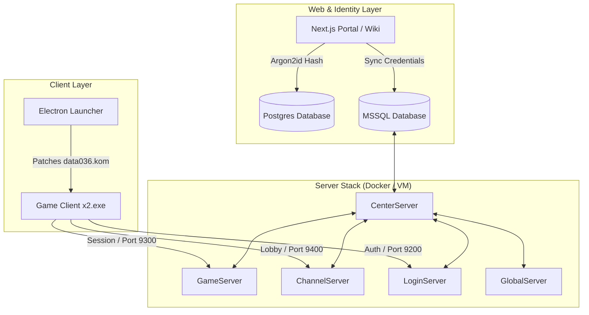

# JoySword Online

JoySword Online is a complete, modernized, self-hosted deployment system for running a private, offline version of the classic JoySword (Elsword) game server. The project bridges the gap between early-2010s Windows game binaries, legacy Microsoft SQL Server databases, and modern cloud/web architectures.

It provides an end-to-end sandbox for game preservation, containing:
* **The Core Server Stack**: Containerized and local execution scripts for the five legacy server processes (*Center*, *Game*, *Channel*, *Login*, and *Global*).
* **Automated Client Patching**: Custom Python scripts that dynamically rewrite local connection IPs and repack client configuration packages (`.kom` files) to seamlessly point the game engine to the server VM.
* **Next.js Web Portal & Wiki**: A beautiful front-end registration portal and historical game wiki that connects web logins directly to the server's MSSQL identity schema.
* **Electron Desktop Launcher**: A user-friendly desktop application to configure display options, patch settings, bypass Windows UAC constraints, and launch the client executable.
* **Infrastructure as Code**: Terraform scripts to host the complete stack securely on Azure.

---

## Architecture Overview



---

## Technical Highlights

### 1. Server Stack Containerization & Port Mapping
* Integrated the 5 core game executable servers with a Microsoft SQL Server database container.
* Configured the exact network boundary maps, securing TCP/UDP channels (9200-9400) for login, gameplay, and channel synchronization.
* Configured recursive path systems (`SimLayer:AddPath`) in LUA configs via custom Python automation.

### 2. Dynamic Client KOM Patching Engine
* Automatically reads IP overrides from staging files (`offline.env`).
* Programmed automated extraction and repacking of encrypted client bytecode archives (specifically `data\data036.kom`), rewriting network endpoints in the client files on-the-fly.

### 3. Next.js Account Portal & Player Wiki
* React-based landing page and registration portal using Next.js.
* User sign-ups are hashed using Argon2id in PostgreSQL, while legacy-safe credentials are simultaneously synced to the MSSQL game-server schema.
* Version-aware, fully searchable Player Wiki featuring progression routes, Ice Burner costume galleries, and cash-shop economics.

### 4. Electron Desktop Launcher
* Electron desktop application that reads the user's local directory, patches the client configuration, and sets custom game settings (resolution and window modes).
* Bypassed Windows administrative prompts using the `RunAsInvoker` shim compatibility layer to guarantee a smooth startup experience.

### 5. Infrastructure as Code (Terraform & Azure)
* Resources to deploy a virtual machine for the game servers and a Linux Web App for the account portal.
* Secure VNet boundaries and key vault integrations for database passwords, hosting the full game-server stack directly on the Azure VM.

---

## Repository Structure

* [**`Elsword/`**](file:///c:/Users/media/Downloads/JoySwordOffline/Elsword) — The legacy game server binaries, configurations, database backups, and operational scripts.
* [**`web/`**](file:///c:/Users/media/Downloads/JoySwordOffline/web) — The modern Next.js web portal, player wiki content, and cash shop galleries.
* [**`launcher/`**](file:///c:/Users/media/Downloads/JoySwordOffline/launcher) — The Electron desktop application codebase and configurations.
* [**`client/`**](file:///c:/Users/media/Downloads/JoySwordOffline/client) — Local client packaging, launch scripts, and desktop installer utilities.
* [**`database/`**](file:///c:/Users/media/Downloads/JoySwordOffline/database) — SQL migration, auditing scripts, and account provisioning schemas.
* [**`infra/`**](file:///c:/Users/media/Downloads/JoySwordOffline/infra) — Infrastructure-as-Code Terraform script configurations targeting Azure deployment.
* [**`scripts/`**](file:///c:/Users/media/Downloads/JoySwordOffline/scripts) — Utility scripts written in Python and PowerShell for environment provisioning, patch overrides, and client testing.
* [**`tests/`**](file:///c:/Users/media/Downloads/JoySwordOffline/tests) — Automated validation suites for checking build integrity and network endpoints.

---

## Quick Start

### 1. Web Account Portal Setup
To run the Next.js account registration portal locally:
```bash
cd web
npm install
npm run dev
```

### 2. Desktop Launcher Setup
To build and run the Electron desktop launcher in development mode:
```bash
cd launcher
npm install
npm run dev
```

### 3. Server Startup (Windows / Azure VM)
To bootstrap the legacy servers and map databases automatically:
```powershell
.\Start-Server-Automatic.ps1
```
This PowerShell script checks local firewall rules, reads configuration credentials, and launches the legacy game executables in their sequential dependency order.

---


## Documentation

For guides on how to install, configure, deploy, and debug, please refer to the following documents:

* [**Deployment Guide**](deployment_guide.md) — Steps to configure and run the server stack locally or on the cloud.
* [**Client Connection Guide**](CLIENT_CONNECTION_GUIDE.md) — Troubleshooting client networking and IP overrides.
* [**Admin Guide**](ADMIN_GUIDE.md) — System administration and management commands.
* [**Troubleshooting Guide**](troubleshooting_guide.md) — Operations runbook and logs auditing.
* [**Operations Overview**](docs/README.md) — Network boundaries, registration API, database synchronization schemas.
