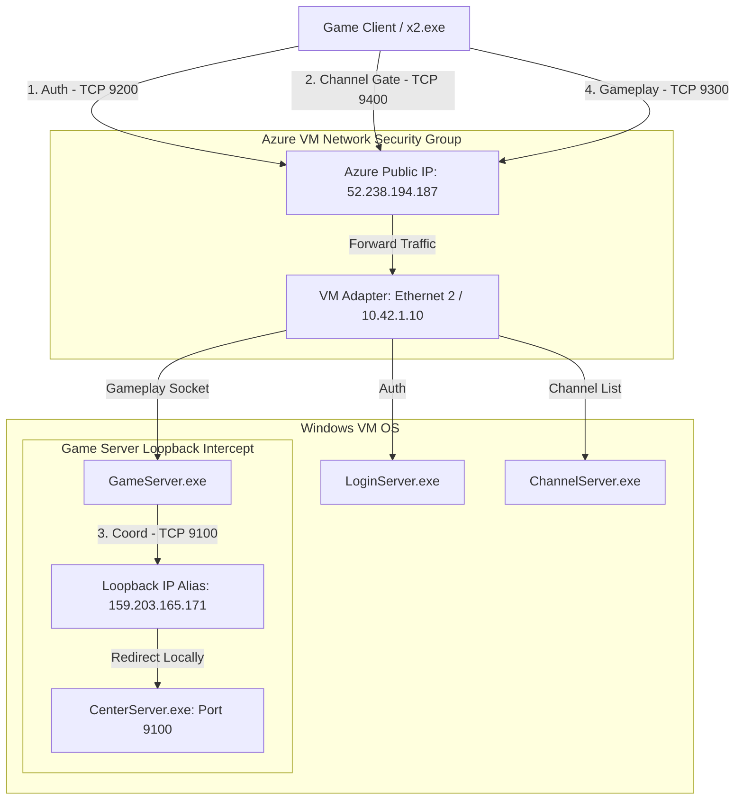

# Azure Game Server Channel Connection & Login Fix

> **Status (July 2026):** This documents the legacy hardcoded-coordination-IP
> workaround, which remains valid for the compiled server binaries. Two things
> have since changed and supersede parts of this doc:
> - Public IP registration into the database is now handled by
>   `scripts\sync-server-ip.ps1` (auto-discovers the VM public IP via Azure
>   IMDS, or takes `-PublicIp`), not manual SQL edits.
> - Full VM bring-up is orchestrated by `scripts\prepare-vm.ps1`; see
>   [deployment_runbook.md](deployment_runbook.md).
>
> The loopback-alias mechanism below is still applied by
> `Start-Server-Automatic.ps1` for the hardcoded CenterServer coordination IP.

This document records the diagnostics, architectural details, and recovery procedures for resolving the Azure deployment connection issues of the JoySword server stack.

---

## 1. Network Topology & Traffic Flow

The following diagram illustrates the relationship between the game client, Azure Network Security Groups, VM network adapters, and the internal loopback IP address alias required by the legacy server binaries:



---

## 2. Issues Identified

### Symptom A: Stuck at Channel Selection
- **Description**: Players log in successfully and view the channel select screen, but clicking on a channel (e.g., "Genesis") causes the client to hang or timeout.
- **Root Cause**: The compiled legacy executables `GameServer.exe` and `CenterServer.exe` contain a hardcoded IP address `159.203.165.171` for internal process coordination on port `9100`. 
- **Impact**: Without this IP configured locally, Windows routes any outgoing requests from `GameServer.exe` to `159.203.165.171` out to the public internet gateway (where it fails). Consequently, the game server cannot establish a session with the center server, preventing the channel selection from resolving.

### Symptom B: Unable to Login
- **Description**: The game client fails to establish a connection at the initial login screen.
- **Root Cause**: The Azure VM was restarted. The JoySword services (such as LoginServer, GameServer, and SQL Server databases) are not registered as automated Windows services or boot-time scheduled tasks. Restarting the VM left all server executables stopped.

---

## 3. Automation Solution (`Start-Server-Automatic.ps1`)

We modified the [Start-Server-Automatic.ps1](../Start-Server-Automatic.ps1) script (Step 2.5) to introduce a self-healing check and dynamic binding mechanism for the hardcoded IP:

```powershell
# 2.5 Ensure the hardcoded loopback IP alias (159.203.165.171) is registered on the active network interface
Write-Host "Verifying hardcoded loopback IP alias (159.203.165.171)..." -ForegroundColor Green
$LoopbackIP = "159.203.165.171"
$IPExists = Get-NetIPAddress -IPAddress $LoopbackIP -ErrorAction SilentlyContinue
if (-not $IPExists) {
    Write-Host "IP alias $LoopbackIP not found. Attempting to register it..." -ForegroundColor Yellow
    try {
        # Dynamically discover primary active interface handling internet default route
        $DefaultRoute = Get-NetRoute -DestinationPrefix "0.0.0.0/0" -ErrorAction SilentlyContinue | Sort-Object RouteMetric | Select-Object -First 1
        if ($DefaultRoute) {
            $Adapter = Get-NetAdapter -InterfaceIndex $DefaultRoute.InterfaceIndex -ErrorAction SilentlyContinue
            if ($Adapter) {
                $InterfaceAlias = $Adapter.Name
                Write-Host "Registering IP alias on interface '$InterfaceAlias'..." -ForegroundColor Yellow
                
                # Check for Administrator permissions
                $IsAdmin = ([Security.Principal.WindowsPrincipal][Security.Principal.WindowsIdentity]::GetCurrent()).IsInRole([Security.Principal.WindowsBuiltInRole]::Administrator)
                if ($IsAdmin) {
                    New-NetIPAddress -IPAddress $LoopbackIP -PrefixLength 32 -InterfaceAlias $InterfaceAlias -Confirm:$false | Out-Null
                    Write-Host "Successfully registered IP alias $LoopbackIP on interface '$InterfaceAlias'." -ForegroundColor Green
                } else {
                    # Request UAC elevation if run without admin rights
                    Write-Host "Requesting Administrator rights to register IP alias..." -ForegroundColor Yellow
                    $RegisterCmd = "New-NetIPAddress -IPAddress '$LoopbackIP' -PrefixLength 32 -InterfaceAlias '$InterfaceAlias' -Confirm:`$false"
                    Start-Process -FilePath "powershell.exe" -ArgumentList "-NoProfile -ExecutionPolicy Bypass -Command `"$RegisterCmd`"" -Verb RunAs -Wait -WindowStyle Hidden
                    Write-Host "IP alias registered successfully!" -ForegroundColor Green
                }
            }
        }
    } catch {
        Write-Warning "Failed to automatically register IP alias: $_"
    }
}
```

---

## 4. Recovery & Verification Checklist

Follow these steps directly within the Azure VM environment to start the server stack:

### Step 1: Access the VM
1. Log into the Azure Portal or use your local RDP client.
2. Establish a Remote Desktop (RDP) connection to the VM public IP `52.238.194.187`. 
   *(Note: Secure RDP port 3389 is restricted at the NSG level to your authorized operator IP address).*

### Step 2: Update and Execute Startup Automator
1. Open PowerShell on the VM.
2. Navigate to the repository workspace and pull the latest codebase changes to sync the updated `Start-Server-Automatic.ps1` script.
3. Execute the script by passing your public IPv4 endpoint:
   ```powershell
   .\Start-Server-Automatic.ps1 -PublicIP 52.238.194.187
   ```

### Step 3: Verify the OS Adaptor Configuration
Run the following command on the VM to verify that the IP alias is active:
```powershell
Get-NetIPAddress -IPAddress 159.203.165.171
```
Expected Output:
```text
IPAddress         : 159.203.165.171
InterfaceIndex    : [Index]
InterfaceAlias    : Ethernet 2
AddressFamily     : IPv4
...
```

### Step 4: Verify Server Process Port Bindings
Ensure the game server sockets are actively listening by running:
```powershell
netstat -ano | findstr -i "listening" | findstr -i "9200 9300 9400"
```

---

## 5. Frequently Asked Questions (FAQ)

#### Q: Why is `159.203.165.171` hardcoded?
**A**: The compiled server executables are legacy binaries whose source code is unavailable. These binaries were compiled with hardcoded connection endpoints for coordination between the `GameServer` and `CenterServer` processes. 

#### Q: Does the loopback alias survive VM reboots?
**A**: Yes. In Windows, network aliases registered via `New-NetIPAddress` are persistent in the registry and survive system reboots. However, the `Start-Server-Automatic.ps1` script performs a pre-flight check every time it runs to verify that the alias is still present.

#### Q: What happens if my VM's active network adapter changes name?
**A**: The startup automator discovers the adapter name dynamically by checking the active gateway route (`0.0.0.0/0`). If the adapter name changes (e.g., from "Ethernet" to "Ethernet 2" or "vEthernet"), the script adapts automatically without requiring configuration updates.
