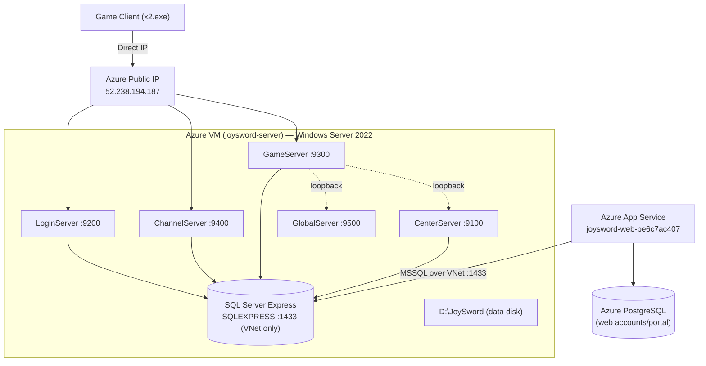

# JoySword Azure Deployment: Overview

> **Deploying or rebuilding? Start with
> [deployment_strategy.md](deployment_strategy.md)** — it's the single
> copy-paste-ready entry point (decision tree + exact commands). This overview
> is the architecture reference behind it.

This document describes the **current** JoySword deployment on Microsoft Azure:
a single Windows VM that hosts the entire game-server stack and SQL Server,
fronted by a Linux App Service web app. There is **no** WireGuard tunnel, edge
relay, or split physical/edge topology — that model was fully removed. Clients
connect directly to the VM's public IP.

> Last full clean-slate rebuild: **July 2026** (see
> [deployment_runbook.md](deployment_runbook.md) for the exact steps and the
> issues resolved during that run).

---

## System Architecture



Key points:

- **One VM hosts everything** — the five legacy server processes plus SQL
  Server Express — reached over the VM's own public IP. No forwarding VM, no
  tunnel.
- **The web app is separate** and was untouched by the game-server rebuild. It
  keeps its own Azure PostgreSQL flexible server for the account portal and
  reaches the VM's SQL over the VNet on `1433`.
- **Game endpoint**: clients are patched directly to `52.238.194.187`. Do not
  use CNAME/FQDN masking for game sockets; the legacy client is IPv4-only here.

---

## Azure resources (`joysword-prod-rg`)

> This resource group is **shared** with unrelated applications (`galx-*`,
> `dreambees-*`). Any Terraform or `az` operation must target only the
> JoySword resources below — never a blanket `destroy`.

| Resource | Name | Role |
|---|---|---|
| Virtual machine | `joysword-server` | Windows game-server host |
| OS disk | `joysword-server-os` | Boot volume (Premium_LRS) |
| Data disk | `joysword-server-data` | `D:\JoySword` — game DBs, workspace (Premium_LRS, `prevent_destroy`) |
| Managed image | `joysword-windows-2022-20260701` | Source image for the VM |
| NIC / Public IP | `joysword-edge-nic` (10.42.1.10) / `joysword-edge-ipv4` (52.238.194.187) | VM networking |
| NSG | `joysword-edge-nsg` | Inbound game ports + scoped RDP/SQL |
| Web app / plan | `joysword-web-be6c7ac407` / `joysword-web-plan` | Account portal (Linux, Node 20) |
| PostgreSQL | `joysword-pg-be6c7ac407` | Web-app database |
| Storage | `jsartbe6c7ac407` | Release/download/backup blobs (`prevent_destroy`) |
| Key Vault | `js-kv-be6c7ac407` | `db-password`, admin password, secrets (`prevent_destroy`) |

State backend: `jstfbe6c7ac407` / container `tfstate` in `joysword-tfstate-rg`.

---

## VM disk layout (`D:\JoySword`)

```text
D:\JoySword\
  Server\            # The cloned workspace (Elsword\, scripts\, database\, ...)
  Client\            # Client assets for server-side path validation
  Database\          # Live SQL .mdf / .ldf files
  DatabaseBackups\   # Restored-from .bak files
  Logs\ Config\ Tools\ ...
```

The OS disk (C:) is disposable and rebuilt from the managed image. **All game
state lives on the D: data disk**, which is `prevent_destroy` in Terraform so a
VM rebuild never wipes it.

---

## Port map

| Port | Proto | Exposure | Role |
|---|---|---|---|
| 9200 / 9201 | TCP / UDP | Public (NSG) | LoginServer |
| 9300 / 9301 | TCP / UDP | Public (NSG) | GameServer |
| 9400 / 9401 | TCP / UDP | Public (NSG) | ChannelServer |
| 9100 | TCP | Private (loopback) | CenterServer coordination |
| 9500 | TCP | Private (loopback) | GlobalServer coordination |
| 1433 | TCP | VNet only (web subnet) | SQL Server Express |
| 3389 | TCP | Operator IP only | RDP |

SQL, RDP, WinRM are never opened to the internet — the NSG is the authoritative
boundary.

---

## Related documents

- [deployment_runbook.md](deployment_runbook.md) — end-to-end deploy procedure + July 2026 rebuild log
- [server_configuration.md](server_configuration.md) — env, launcher, startup flow
- [database_setup.md](database_setup.md) — SQL config, restore, secrets
- [client_patching.md](client_patching.md) — pointing the client at the server
- [channel_connection_fix.md](channel_connection_fix.md) — legacy hardcoded-IP notes
- [../docs/AGENT_ACCOUNT_INITIALIZATION.md](../docs/AGENT_ACCOUNT_INITIALIZATION.md) — client account init: `GetUID() : 0`, the row set, repair tool
- [../docs/AGENT_WEB_REGISTRATION_PLAYBOOK.md](../docs/AGENT_WEB_REGISTRATION_PLAYBOOK.md) — web registration 503s, MSSQL provisioning, VNet SQL troubleshooting
- [troubleshooting_log.md](troubleshooting_log.md) — diagnostics reference
