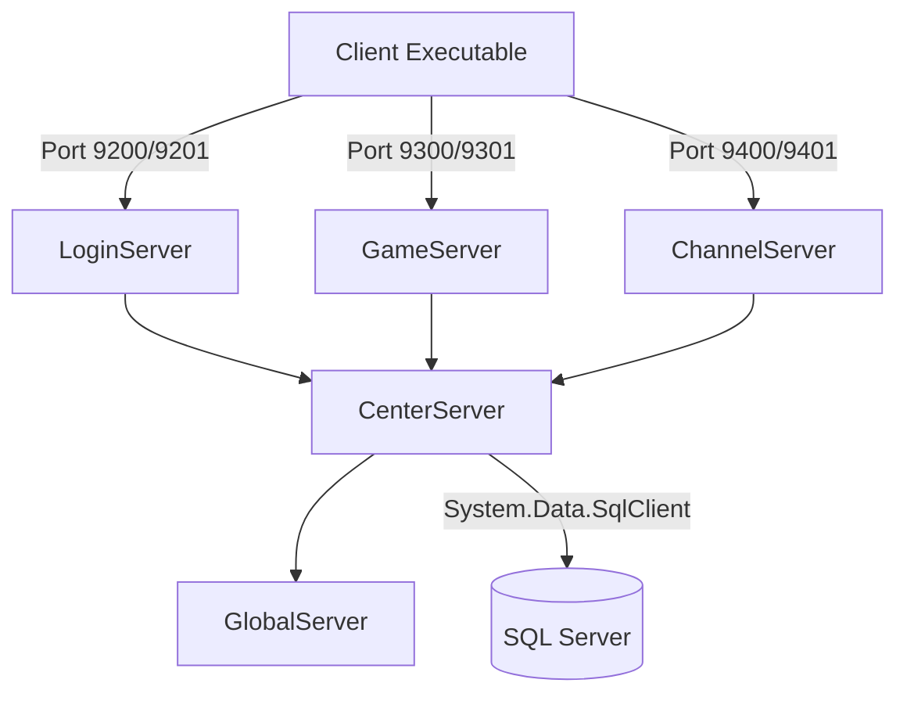

# JoySword Offline Server Deployment Guide

This guide documents the server architecture, deployment flow, configuration layout, and operational commands used to package and host the JoySword server on the Azure Virtual Machine.

### Documentation Index
* **[Server Deployment Guide](deployment_guide.md)**
* **[Client Connection Guide](client_connection_guide.md)**
* **[Troubleshooting Guide](troubleshooting_guide.md)**

---

## Table of Contents
1. [Server Architecture](#1-server-architecture)
2. [Network Security & Port Mapping](#2-network-security--port-mapping)
3. [Server Configuration & Paths](#3-server-configuration--paths)
4. [Packaging & Deployment Flow](#4-packaging--deployment-flow)
5. [Database & Backups](#5-database--backups)
6. [Operational Commands (VM Ops)](#6-operational-commands-vm-ops)

---

## 1. Server Architecture

The JoySword game server consists of **five core executable processes** and a **Microsoft SQL Server database layer**:



### Server Roles
* **CenterServer**: Orchestrates the communication between all other server nodes. It maintains global server state and databases, handles room creations, and loads dungeon files.
* **GameServer**: Manages all gameplay logic, instanced dungeon states, monster updates, and player positioning.
* **ChannelServer**: Handles server lobbies, chat channels, and social features.
* **LoginServer**: Authenticates users and routes them to the correct channel gate.
* **GlobalServer**: Handles secondary backend tasks (e.g. events, missions, backups).
* **SQL Server**: Hosts the databases `Account`, `Game`, and `Log`.

---

## 2. Network Security & Port Mapping

The VM requires specific port configuration in both the Azure Network Security Group (NSG) and the Windows Defender Firewall to support client connections:

| Port | Protocol | Direction | Source | Destination | Process / Role |
| :--- | :--- | :--- | :--- | :--- | :--- |
| **9200** | TCP | Inbound | Any / Client | VM | Login Server Connection Gate |
| **9201** | TCP / UDP | Inbound | Any / Client | VM | Login Server Sync & Pings |
| **9300** | TCP | Inbound | Any / Client | VM | Game Server Connection Gate |
| **9301** | TCP / UDP | Inbound | Any / Client | VM | In-Game Map / Field Sync |
| **9400** | TCP | Inbound | Any / Client | VM | Channel Server Connection Gate |
| **9401** | TCP / UDP | Inbound | Any / Client | VM | Channel Server Sync |
| **1433** | TCP | Local / Internal | localhost | localhost | SQL Server Database Access |

---

## 3. Server Configuration & Paths

During deployment, the configuration files `config_*.lua` inside each server folder are dynamically rewritten using python scripts to switch the server endpoints to offline mode and configure relative file lookup paths.

### Search Path System (`SimLayer:AddPath`)
The server executable loads configurations and game scripts dynamically. If a script is requested, the server searches the registered directories in order. It does **not** perform recursive searches.

To resolve this, [configure-offline.py](file:///c:/Users/media/Downloads/JoySwordOffline/scripts/configure-offline.py) recursively walks the `ClientScript` folder, identifying all subfolders containing `.lua` files (such as `Field_Script` and `Field_World` subdirectories), and registers them dynamically in the configuration files:

```lua
-- SimLayer Paths (Sample output generated dynamically)
SimLayer:AddPath( "C:\\JoySword\\current\\Elsword\\GameServer" )
SimLayer:AddPath( "C:\\JoySword\\current\\Elsword\\ServerResource" )
SimLayer:AddPath( "C:\\JoySword\\current\\Elsword\\Resources" )
SimLayer:AddPath( "C:\\JoySword\\current\\Elsword\\ClientScript" )
SimLayer:AddPath( "C:\\JoySword\\current\\Elsword\\ClientScript\\Major\\Field_Script\\Ruben_Field" )
-- ... (and 44 other subdirectories)
```

To run a configuration pass manually in the workspace:
```bash
python scripts/configure-offline.py --repo-root C:\Users\media\Downloads\JoySwordOffline
```

---

## 4. Packaging & Deployment Flow

Deployments are packaged from the local checkout and copied to the target deployment:

1. **Exclusions check**: [deploy_excludes.py](file:///c:/Users/media/Downloads/JoySwordOffline/scripts/deploy_excludes.py) determines which local source files are skipped to reduce transfer size. *Note: We modified this script to ensure critical `Dungeon` and `World` scripts are packaged.*
2. **Release creation**: `azure_release.py` generates a release ZIP, creates a new version folder, and extracts the bundle.
3. **Junction updates**: The system uses a Directory Junction link (`C:\JoySword\current`) to point to the active release directory.
4. **Configuration**: `configure-offline.py` is run to apply local credentials, IPs, and compile the recursive search path list in the active release configurations.

---

## 5. Database & Backups

JoySword runs on a Microsoft SQL Server backend containing three primary databases:
* **`Account`**: User registration records, login logs, billing nodes, and cash currency balances.
* **`Game`**: Character statistics, skills, equipment, inventories, and cash item purchases.
* **`Log`**: In-game event logs, transaction logs, and chat records.

### Database Backups & Restore
JoySword databases can be restored in the local container environment from base backups using the local database restore automation:

```powershell
# Restore standard databases inside local docker container
scripts\restore-databases.bat
```

---

## 6. Operational Commands & Sovereign SRE Management

All server management operations use Python SRE utilities from the workspace root.

### Sovereign SRE Master Utility (`sovereign-guard.py`)
The master SRE CLI manages stack health, auto-healing, and preflight auditing:
```powershell
# 1. Run 4-layer system preflight audit
python scripts\sovereign-guard.py --audit

# 2. Auto-heal: release orphan ports, prune log bloat, refresh SQL statistics
python scripts\sovereign-guard.py --auto-heal

# 3. View real-time SRE stack telemetry table
python scripts\sovereign-guard.py --status

# 4. Roll back to previous configuration snapshot
python scripts\sovereign-guard.py --rollback
```

### High-Throughput Database Optimization (`db-optimize-storage.py`)
To enable Read Committed Snapshot Isolation (RCSI lockless concurrency), forced delayed durability, forced query parameterization, Query Store, and index defragmentation:
```powershell
python scripts\db-optimize-storage.py
```

### Chaos Engineering & Strategy Benchmarking
To test zero-downtime stack auto-recovery under simulated fault injection or execute empirical benchmarking:
```powershell
# Run Chaos Monkey fault injection dry-run
python scripts\chaos-test.py --dry-run

# Run strategy benchmark suite
python scripts\benchmark-strategy.py
```

### Stop & Start the Server Stack
```powershell
# Start supervised server stack (with automatic crash recovery & webhook alerts)
python scripts\start-offline.py --supervise

# Stop server stack and release network ports
python scripts\stop-offline.py
```

---

## 7. Strategy Documentation Index

* **[Sovereign SRE Architecture Guide](docs/SOVEREIGN_SRE_ARCHITECTURE.md)**
* **[High-Throughput Database & SQL Guide](docs/DATABASE_HIGH_THROUGHPUT_GUIDE.md)**
* **[Chaos Engineering & Testing Guide](docs/CHAOS_ENGINEERING_AND_TESTING.md)**
* **[Strategy Benchmark Results](docs/STRATEGY_BENCHMARK_RESULTS.md)**

