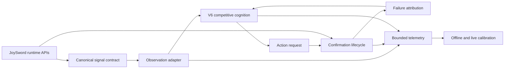

# JoySword NPC PvP Intelligence V7 Strategy

- **Program:** Runtime Grounding, Behavioral Verification, and Calibration Readiness
- **Scope:** Ten Hero NPC Lua profiles under `Elsword/ClientScript/Npc/`
- **Status:** Implemented and offline-validated; live arena calibration pending
- **Audience:** Combat designers, gameplay engineers, maintainers, and arena testers

## Document control and review posture

| Field | Value |
|---|---|
| Document revision | 1.1, assurance-grade review edition |
| System version | NPC PvP Intelligence V7 |
| Canonical implementation | `PVP_HERO_AMELIA.lua`, propagated shared core |
| Review status | Candidate for adversarial technical review |
| Approval represented here | None; this document records evidence, not organizational sign-off |
| Highest evidence attained | E3, deterministic approximate-engine simulation |
| Highest evidence not attained | E4, observed live arena execution |

The terms **must**, **must not**, **required**, and **prohibited** define release
gates. The terms **should** and **recommended** define calibration guidance that
may be overridden only with a recorded rationale. Descriptive identity language
is a design target unless accompanied by an evidence label.

Evidence labels used throughout this documentation set are:

| Level | Name | Permitted conclusion |
|---|---|---|
| E0 | Design assertion | Intended behavior only |
| E1 | Static artifact evidence | Source structure, references, guards, and bounds exist |
| E2 | Deterministic decision simulation | Behavior holds in the fixed abstract scenario suite |
| E3 | Deterministic engine approximation | Behavior holds under modeled timing and callback disturbances |
| E4 | Live arena observation | Behavior was observed in the real client and engine |
| E5 | Replicated live evaluation | E4 result repeated across builds, environments, and reviewers |

Evidence levels are not interchangeable. In particular, E3 cannot be used to
claim live timing accuracy, perceptual human-likeness, or competitive balance.

## Purpose

V7 is the operational strategy for turning the V6 competitive-cognition system
into behavior that can be observed, explained, and calibrated against the real
JoySword runtime.

V6 gave each bot a persistent competitive mind: match strategies, exchange
plans, tactical intentions, opponent hypotheses, conditioning, character
identity, combo judgment, and bounded imperfection. V7 does not replace that
architecture. It verifies whether V6 intentions survive engine timing, action
availability, callback ordering, ambiguous hit evidence, and temporary missing
runtime values.

The program optimizes for **coherent execution**, not raw win rate. A successful
bot should visibly pursue its intended plan, respond to evidence it could
reasonably observe, preserve its character identity, and remain punishable.

## Assurance thesis and falsification rule

The bounded thesis of V7 is:

> Within the declared static and synthetic scenario domains, V7 translates V6
> intentions into terminal, attributable, bounded action lifecycles without
> promoting unavailable engine information to direct gameplay truth.

This thesis is intentionally narrower than "the bots play like expert humans."
It is falsified by any reproducible counterexample in scope, including:

- A requested action remaining non-terminal beyond its declared timeout.
- One result being attributed to more than one action.
- An engine rejection incrementing strategic failure as if the tactic ran.
- A stale or nil observation entering selection as current verified truth.
- Telemetry, route memory, observations, or lifecycle history exceeding bounds.
- An `UNAVAILABLE` signal affecting action utility as direct evidence.
- Shared-core drift between profiles where identical behavior is required.

A live-arena claim requires E4 evidence and is not established by the current
thesis.

## Strategic outcome

The target operating model is:

```text
verified or bounded runtime evidence
    -> normalized observation
    -> V6 competitive decision
    -> action request
    -> engine execution evidence
    -> explicit confirmation result
    -> correctly attributed learning
    -> bounded telemetry for calibration
```

The key shift is from "the bot selected an intelligent action" to "the bot
selected an intelligent action, the engine executed it, and the result was
classified with an honest confidence level."

## What V7 is

- A canonical contract for all runtime signals consumed by cognition.
- A narrow normalization adapter between engine APIs and V6 memory.
- An explicit action lifecycle with bounded timeouts and uncertain outcomes.
- Character-specific timing and range calibration surfaces.
- A separation of decision, execution, confirmation, tactical, and strategy
  failures.
- Bounded diagnostics for occupancy, repetition, identity, range, resources,
  dormant actions, and counterfactual stability.
- An approximate-engine harness for deterministic offline disturbance testing.

## What V7 is not

- A replacement strategy layer above V6.
- An input-reading or frame-perfect reaction system.
- Proof that bots behave correctly in a live arena.
- An exact frame-data database.
- A fabricated source of opponent cooldowns, resources, terrain, collision, or
  block state.
- A win-rate maximizer.

## Program objectives and acceptance propositions

The strategy is governed by executable propositions rather than qualitative
aspiration alone.

| ID | Proposition | Offline oracle | Gate |
|---|---|---|---:|
| P-01 | Every profile parses and resolves named states, callbacks, actions, and finishers | Static validator and Lua 5.1 parser | 10/10 |
| P-02 | Every requested synthetic action reaches exactly one terminal result | Engine-approximation harness | `terminals = requests`; duplicate count `0` |
| P-03 | Ambiguous evidence remains representable | Ambiguous-confirmation scenario | At least one uncertain result per profile |
| P-04 | Engine rejection is isolated from strategy learning | Repeated-rejection scenario | Strategy failures caused by rejection `0` |
| P-05 | Transient state is reset without erasing intended match memory | Life/round reset scenarios | No unresolved action; persistence checks pass |
| P-06 | Adaptive state remains bounded | Static and runtime bounds | Telemetry `<=96`, routes `<=48`, observations `<=32` |
| P-07 | Harmless perturbation does not cause brittle selection changes | Counterfactual diagnostic | Stability `>=0.70` per profile |
| P-08 | Observable synthetic identity signatures are non-identical | Roster validator | Unique signatures; minimum normalized distance `>=0.20` |
| P-09 | Original action repetition remains below the roster regression limit | Original scenario suite | Maximum `<=0.59` |
| P-10 | No hidden or unavailable information is admitted as direct truth | Contract and static validator | Zero violations |

These thresholds are engineering regression gates, not universal scientific
constants. Altering one requires a documented reason, before/after evidence,
and review of whether the new threshold hides a regression.

## Architectural strategy



One path owns behavior. Telemetry observes that path but cannot select or alter
actions. Character profiles configure the shared core without forking its
interpretation of engine evidence.

### Architectural invariants

| ID | Invariant | Consequence of violation |
|---|---|---|
| A-01 | V6 remains the sole strategic decision authority | Competing subsystems can oscillate or provide contradictory learning |
| A-02 | Runtime normalization precedes evidence consumption | Nil and stale values can masquerade as current facts |
| A-03 | One active attributable action owns combat feedback | HP/state events can train unrelated actions |
| A-04 | Terminal action state is immutable | Reordered callbacks can rewrite completed outcomes |
| A-05 | Telemetry is observational only | Metrics can distort gameplay or create feedback loops |
| A-06 | Character profiles configure but do not reinterpret signals | Identical engine evidence can acquire contradictory meanings |
| A-07 | Every adaptive structure has a cap and decay/lifetime policy | Match memory can grow or preserve stale beliefs indefinitely |
| A-08 | Unavailable signals remain non-authoritative | The bot acquires information unavailable to a player |

## Program workstreams

### 1. Runtime truth and signal governance

Every consumed value belongs to one of five classes:

| Class | Meaning | Gameplay policy |
|---|---|---|
| `VERIFIED_DIRECT` | Returned directly by an available runtime API | May support high-confidence decisions, with nil guards |
| `VERIFIED_DERIVED` | Computed from verified direct values | Confidence reflects derivation and staleness |
| `HEURISTIC` | A bounded interpretation of incomplete evidence | Never presented as exact truth |
| `UNVERIFIED` | Plausible but not established in the canonical runtime path | Diagnostic use only |
| `UNAVAILABLE` | No supported runtime source exists | Must never enter gameplay as direct truth |

The contract is shared across all ten scripts. New signals must be added there
before behavior can consume them.

### 2. Observation normalization

Raw values are converted into short-lived observations such as damage taken,
distance closed, probable action start, resource change, interruption, life
reset, or probable defensive response.

Each observation carries:

- Decision tick
- Source signal
- Confidence
- Expiration window
- Related action, when applicable
- Direct or inferred classification

Stale observations expire. Nil values do not silently become zero or false.

### 3. Intent-to-execution verification

The action lifecycle distinguishes:

1. Selection by cognition
2. Request through the Lua callback
3. Start evidence from the runtime
4. Contact-window entry
5. Result evidence
6. Recovery or terminal classification
7. Exchange-plan and strategy feedback

An action that never starts is an execution failure, not proof that the tactic
or match strategy was wrong. Ambiguous evidence produces an uncertain result.

### 4. Timing and range calibration

Timing profiles use bounded ranges rather than invented frame counts:

```text
startup_min / startup_max
contact_min / contact_max
recovery_min / recovery_max
movement duration
follow-up window
resource-change delay
absolute timeout
timing confidence
observation count
```

Shared safe defaults are separated from character overrides, matchup learning,
and runtime-observed estimates. Observations may adjust estimates only within
declared safe bounds.

### 5. Identity preservation

Identity is measured through observable behavior rather than internal labels:

- Engagement range
- Observation and commitment rates
- Movement and action-family distribution
- Guard, escape, reset, extension, and retreat frequency
- Resource spending
- Strategy persistence and tempo changes
- Behavior while ahead or behind

The ten runtime identities are:

| Character | Runtime identity |
|---|---|
| Amelia | Patient foresight analyst |
| Apple | High-conversion optimizer |
| Balak | Far-rotation spacing technician |
| Edan | Relentless pressure specialist |
| Lime | Defensive survival specialist |
| Low | Volatile momentum duelist |
| Noa | Resource-control strategist |
| Penensio | Adaptive guard all-rounder |
| Q-PROTO_00 | Reactive punish specialist |
| Spika | Deceptive conditioning specialist |

### 6. Evidence-led calibration

Calibration follows this order:

1. Verify signal availability and nil behavior.
2. Verify action request, start, contact, and terminal classification.
3. Fix execution and confirmation failures before changing strategy weights.
4. Tune ranges and timing from repeated contextual failures.
5. Verify exchange-plan completion and strategy occupancy.
6. Compare observable identity distributions.
7. Tune combat balance only after execution is trustworthy.

This sequence reduces the risk of weakening a strategy to compensate for a
broken action transition or an incorrect timing assumption.

## Calibration decision rules

| Observation | First investigation | Avoid |
|---|---|---|
| Frequent request-without-start | State eligibility, callback path, resource requirement | Penalizing the strategy |
| Repeated probable whiff at one range | Range override and movement during startup | Faster reactions |
| Damage appears after timeout | Contact/confirmation window and callback delay | Global timeout inflation |
| One defense repeats | Available alternatives and opponent behavior | Blind anti-repetition penalties |
| Strategy changes too quickly | Transition reason, evidence threshold, emergency state | Fixed strategy quotas |
| Strategy never changes | Failure evidence, occupancy timeout, stale hypotheses | Random strategy rotation |
| Identity collapses to fallback movement | Action execution failures and missing signals | Cosmetic identity weights |
| Resource read remains uncertain | Use low-risk pressure or probe | Pretending cooldown certainty |

## Controlled calibration workflow

Calibration is a causal investigation, not an iterative search for a higher win
rate. Each candidate change must follow the sequence below.

### Step 0: Freeze the comparison

Record the source revision, modified files, runtime profile, map, opponent
archetype, random seed when available, and tool versions. Do not compare two
builds that also differ in matchmaking, rewards, stats, networking, or map
configuration.

### Step 1: State the defect as an observable

Use a falsifiable form such as "`shock_wave` requests fail to produce start
evidence in more than X of Y eligible trials" rather than "Edan feels passive."
Separate the unit of analysis: action, exchange, life, round, or match.

### Step 2: Establish attribution

Trace the event through selection, request, start, contact, terminal result, and
learning. A strategy or identity weight must not be changed until execution and
confirmation have been ruled out as the cause.

### Step 3: Make the smallest scoped change

Prefer, in order: signal guard, timing/range calibration, action prerequisite,
profile override, shared utility change, then strategic redesign. A later item
requires evidence that earlier layers are not responsible.

### Step 4: Run paired evidence

Use the same scenario conditions before and after the change. Report counts and
denominators, not percentages alone. Decision ticks are correlated within a
scenario and must not be presented as independent statistical samples.

### Step 5: Review adverse effects

Check lifecycle completeness, uncertainty, repetition, occupancy, identity,
memory bounds, and unrelated profiles. An improvement in one action does not
pass if it creates a loop, erases identity, or increases hidden-information
dependence.

### Step 6: Promote or roll back

Promotion requires all hard gates and a recorded interpretation. Failure of a
hard gate requires rollback or an explicit quarantine; it cannot be waived by
better win rate.

## Proposed live-study design

Live calibration is a staged experiment and must be reported separately from
the offline baseline.

| Element | Required design |
|---|---|
| Experimental unit | Match for outcome/identity; exchange for plan completion; action request for lifecycle accuracy |
| Pilot | Instrument Amelia first; use the pilot to estimate variance and failure incidence |
| Controls | Fixed build, map subset, opponent archetype, stats, and connection mode |
| Comparison | Paired baseline/candidate runs under matched conditions where feasible |
| Sampling | Do not infer population-level effects from one match or one opponent; determine formal sample size after pilot variance is known |
| Annotation | Preserve lifecycle telemetry and independently annotate visible start/contact/result from replay or direct observation |
| Subjective review | Blind reviewers to build identity when rating readability or character distinctness where practical |
| Reporting | Publish raw counts, denominators, exclusions, build identifiers, and unresolved classifications |
| Stop rule | Stop immediately on crashes, unbounded state, action loops, hidden-information use, or duplicate attribution |

The live pilot is exploratory until its protocol, endpoints, exclusions, and
sample-size rationale are frozen. It must not be described as confirmatory
after observing favorable results.

## Risk register

| Risk | Severity | Current control | Residual status |
|---|---|---|---|
| Synthetic harness and implementation share assumptions | High | Adversarial disturbance scenarios and explicit E3 ceiling | Requires E4 independent observation |
| Timeout termination masks incorrect classification | High | Separate liveness from result accuracy; exercise uncertain state | Live annotation required |
| Identity metric is partly configuration-derived | Medium | Use observable role/range/tempo features | Blind perceptual review required |
| Thresholds become targets rather than safeguards | Medium | Record rationale and retain raw distributions | Reviewer oversight required |
| Timing estimates overfit one action context | Medium | Contextual statistics and bounded updates | Cross-map/opponent live study required |
| Telemetry perturbs legacy scheduling | Medium | Bounded, optional, non-blocking events | Compare enabled versus disabled live runs |
| Dirty workspace obscures causal scope | High | Scoped diff checks and artifact manifest | Freeze a clean review revision before release |

## Offline evidence baseline

The current offline baseline is:

- Ten Lua profiles parse and pass static callback/action/state validation.
- 100 original V6 scenarios and 36,000 decision ticks pass.
- 200 V7 engine-approximation scenarios and 28,000 decision ticks pass.
- 1,237 of 1,237 requested actions reach terminal states.
- Telemetry remains bounded at 96 entries.
- Route memory remains bounded at 48 entries.
- Observation memory remains bounded at 32 entries.
- Maximum observed original-suite action repetition is `0.583`.
- Eighteen observable identity dimensions are active.
- The closest normalized identity pair is Amelia and Q-PROTO_00 at `0.222`.

These results prove deterministic and approximate-engine robustness only. They
do not prove live timing, collision, hit confirmation, or player-facing feel.

### Interpretation constraints

- The 64,000 decision ticks are correlated events inside 300 scripted
  scenarios, not 64,000 independent experimental subjects.
- The disturbance suite is purpose-built and deterministic; it is not a random
  sample of all engine behavior.
- A terminal timeout proves lifecycle liveness, not that the result class is
  correct.
- Identity distance is relative to the ten current profiles and selected
  features; it does not establish perceptual distinctness for players.
- Synthetic execution and tactical failures are injected test outcomes, not
  estimated live defect rates.

## Live calibration strategy

### Stage A: Canonical Amelia

- Run mirror matches first.
- Record request-to-start, start-to-contact, and contact-to-result timing.
- Inspect uncertain and timed-out actions.
- Verify life resets clear transients while preserving match memory.
- Confirm that telemetry never changes gameplay authority.

### Stage B: Identity stress profiles

- Penensio: guard and Rune Guard confirmation.
- Balak: far-range rotation and movement completion.
- Low: momentum transitions, close-range repetition, and comeback commitment.
- Lime: guard/escape diversity under sustained pressure.
- Q-PROTO_00 versus Amelia: verify that their closest offline signatures remain
  visibly distinct.

### Stage C: Dormant-action setups

Reproduce the actual conditions for Amelia's `ranger_air_drop`, Edan's
`shock_wave`, Low's `fatal_fury` and `revenge_parry`, Penensio's
`revenge_parry`, and Spika's `aging`. Rare actions should remain rare; the test
only verifies that their real prerequisites are achievable.

### Stage D: Matchup matrix

Test aggressive, defensive, movement-heavy, repetitive, and
resource-conservative opponents. Compare execution reliability and identity
before comparing win rate.

## Acceptance and promotion criteria

### Hard offline gates

- P-01 through P-10 pass without waiver.
- Shared-core regeneration is byte-stable where intended.
- Every changed profile passes Lua 5.1 and the static validator.
- The original V6 suite passes before V7 disturbance results are considered.
- No unrelated production file is modified by propagation or validation.

### Hard live safety gates

- No crash, state-transition loop, or permanently unresolved action.
- No duplicate action attribution.
- No hidden or unavailable signal used as current direct truth.
- Telemetry, route, observation, and lifecycle histories remain within bounds.
- Life and round resets clear transients without unintended match-memory loss.

### Calibration gates requiring pilot baselines

The acceptable live rates for start evidence, uncertain classification, range
failure, plan completion, and identity separation must be preregistered after a
pilot estimates their variance. The current documentation intentionally does
not invent universal thresholds without live data.

### Release claim permitted after current evidence

"V7 is offline calibration-ready under the declared deterministic suites."

### Release claims prohibited after current evidence

- "V7 is live validated."
- "V7 produces human-level or professional-level play."
- "V7 has accurate frame data."
- "V7 improves win rate or player experience in the live engine."

## Change-control policy

### Change classes

| Class | Examples | Required review and validation |
|---|---|---|
| C0: Documentation | Clarification, evidence correction, protocol revision | Link, consistency, and claim-language checks |
| C1: Calibration | Timing/range bound or profile threshold | Amelia test when shared, affected profile harness, all-roster regression |
| C2: Identity logic | Character utility, role, tempo, or range preference | Affected profile evidence plus roster identity gate |
| C3: Shared cognition/runtime core | Adapter, lifecycle, failure attribution, memory | Amelia-first validation, deterministic propagation, full suite |
| C4: Signal semantics/API | Signal class, source API, persistence, confidence | Contract audit, nil/adversarial tests, independent reviewer approval |

### Required change record

Every C1-C4 change must record:

1. Defect statement and unit of analysis.
2. Hypothesis and predicted observable change.
3. Files and configuration in scope.
4. Before/after commands and raw result lines.
5. Hard gates and calibration metrics.
6. Adverse effects and unresolved uncertainty.
7. Rollback procedure.
8. Evidence level attained.

### Authority and separation of duties

The change author proposes and implements. A technical reviewer verifies signal
semantics and scope. A test reviewer verifies the oracle and evidence language.
The release owner decides promotion. One person may fill multiple roles in a
small project, but the document must disclose that independence was absent.

### Canonical propagation sequence

1. Modify Amelia first when changing shared V7 behavior.
2. Run static and approximate-engine validation on Amelia.
3. Propagate the canonical core deterministically.
4. Keep identity configuration outside the shared core.
5. Run all ten profiles and the roster-distinctness gate.
6. Run scoped diff and unrelated-file checks.
7. Document whether evidence is E1, E2, E3, E4, or E5.
8. Do not tune unrelated matchmaking, rewards, networking, or progression in a
   cognition change.

### Rollback triggers

Rollback is mandatory for a new lifecycle leak, duplicate attribution, bound
violation, hidden-information path, parser/reference regression, deterministic
propagation drift, or unexplained cross-profile identity collapse.

## Requirements-to-evidence traceability

| Requirement | Primary implementation artifact | Primary oracle | Evidence |
|---|---|---|---|
| Signal classification and nil safety | `PVP_HERO_AMELIA.lua` V7 contract/adapter | `validate-pvp-ai-v6.py --require-v7` | E1 |
| Lifecycle liveness and attribution | V7 execution state machine | `pvp-ai-v6-harness.lua --v7` | E3 |
| Shared-core identity | Ten Hero NPC scripts | `propagate-pvp-ai-v7.py --check` | E1 |
| Strategy/action regression | V5/V6 shared core | Original harness scenarios | E2 |
| Identity separation | Ten runtime profiles | `validate-pvp-ai-v7-roster.py` | E3 |
| Bounded telemetry and memory | V7 constants and ring operations | Static validator and runtime peaks | E1/E3 |
| Live timing and player readability | Legacy client and arena | Proposed live study | Not attained; E4 required |

## Adversarial review checklist

A reviewer should reject promotion if any answer below is missing:

1. What observation would falsify the claimed improvement?
2. Is the oracle independent of the code path being tested?
3. Are counts accompanied by denominators and exclusions?
4. Are ticks or actions incorrectly treated as independent samples?
5. Did any threshold change after results were observed?
6. Could timeout completion hide incorrect classification?
7. Could identity separation be circular because the metric reflects profile
   configuration?
8. Was live evidence clearly separated from E1-E3 evidence?
9. Can a clean reviewer revision reproduce the pass tokens?
10. Is rollback possible without touching unrelated systems?

## Document revision history

| Revision | Date | Change |
|---|---|---|
| 1.0 | 2026-07-16 | Initial V7 implementation and calibration strategy |
| 1.1 | 2026-07-16 | Added the assurance thesis, falsifiable program propositions, architectural invariants, controlled calibration study, risk register, hard promotion gates, change classes, traceability matrix, and adversarial review protocol |

## Companion documents

- [Companion Brief](PVP_AI_V7_COMPANION_BRIEF.md)
- [Design Philosophy](PVP_AI_V7_DESIGN_PHILOSOPHY.md)
- [Technical Whitepaper](PVP_AI_V7_WHITEPAPER.md)
- [PvP Test Matrix](PVP_TEST_MATRIX.md)
- [PvP Netcode Audit](PVP_NETCODE_AUDIT.md)
