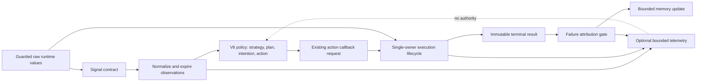
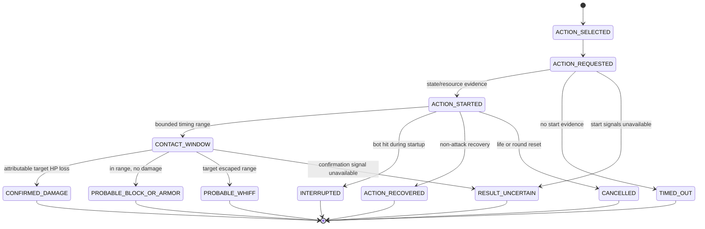

# Runtime-Grounded Competitive Cognition for Legacy Action-Game NPCs

## The JoySword NPC PvP Intelligence V7 Whitepaper

- **Version:** 7.0
- **Document revision:** 1.1, adversarial-review edition
- **Date:** 2026-07-16
- **Implementation status:** Complete for static, deterministic, and
  approximate-engine validation
- **Live validation status:** Not performed
- **Evidence ceiling:** E3, deterministic engine approximation
- **Review status:** Candidate technical whitepaper; not peer reviewed

## Abstract

JoySword NPC PvP Intelligence V7 is a runtime-grounding layer for a persistent
competitive decision architecture implemented in ten legacy Elsword Hero NPC
Lua scripts. Earlier generations established contextual opponent memory,
hierarchical strategy, active probing, conditioning, engagement phases,
character-specific playbooks, combo judgment, adaptive defense, and bounded
human-like imperfection. V7 addresses a different problem: whether those
decisions can be translated into coherent actions by an incompletely documented
legacy engine.

The system introduces a canonical 48-signal contract, an expiring observation
adapter, an explicit action-confirmation state machine, bounded character timing
profiles, failure attribution across five reasoning levels, conservative
resource inference, identity and occupancy diagnostics, and a deterministic
approximate-engine harness. Across ten profiles, the final offline suite
completed 300 scenarios and 64,000 decision ticks. The V7 approximation issued
1,237 action requests, all of which reached terminal lifecycle states, while
telemetry, route memory, and observation memory remained bounded.

These results establish structural and deterministic robustness. They do not
establish live collision behavior, exact timing, animation cancellation,
network scheduling, or player-facing quality. The paper therefore treats live
arena calibration as a separate evidence stage.

**Keywords:** game AI, runtime grounding, bounded rationality, action
attribution, uncertainty, deterministic simulation, behavioral calibration,
legacy engine, NPC identity, assurance case

## Research thesis

The thesis evaluated by this work is deliberately bounded:

> A hierarchical competitive decision system can preserve causal learning and
> bounded operation under delayed, missing, reordered, and ambiguous runtime
> evidence when action selection is separated from execution confirmation by a
> classified observation contract and a terminal lifecycle.

The thesis concerns architecture and modeled disturbances. It does not claim
that the resulting bots are indistinguishable from people, competitively
optimal, balanced, or validated in the live JoySword engine.

## Research questions

| ID | Research question | Evidence required for the present paper |
|---|---|---|
| RQ1 | Can every selected/requested action terminate safely under modeled timing and callback disturbances? | E3 lifecycle results |
| RQ2 | Can execution and confirmation failures be prevented from contaminating tactical and strategic learning? | E1 path audit plus E3 rejection/interruption scenarios |
| RQ3 | Can stale, nil, and unavailable signals be prevented from acting as current direct truth? | E1 contract/guard audit plus E3 nil/expiry scenarios |
| RQ4 | Can adaptive memory and telemetry remain bounded across all deterministic scenarios? | E1 caps plus E2/E3 observed peaks |
| RQ5 | Do character profiles produce non-identical observable signatures in the fixed approximation suite? | E3 roster metric |
| RQ6 | Are selected actions stable under declared harmless perturbations while remaining responsive to material evidence? | E3 counterfactual diagnostic |
| RQ7 | Do these properties survive real animation, collision, scheduling, and player interaction? | E4; outside current evidence |

RQ7 is intentionally unanswered. Its presence prevents a favorable answer to
RQ1-RQ6 from being generalized into a live-game conclusion.

## Executable hypotheses and falsifiers

These are deterministic acceptance hypotheses, not population-statistical
hypotheses. A single in-scope counterexample falsifies the corresponding claim.

| ID | Hypothesis | Falsifier | Result |
|---|---|---|---|
| H1 | Every V7 request reaches exactly one terminal state | Any leak or duplicate attribution | Supported at E3: `1,237/1,237`, duplicates `0` |
| H2 | Ambiguous evidence remains explicitly uncertain | Any profile cannot exercise `RESULT_UNCERTAIN` | Supported at E3: all profiles exercised uncertainty |
| H3 | Engine rejection does not train strategic failure | Rejection-only scenario increments strategy failure | Supported at E3 |
| H4 | Adaptive structures respect declared bounds | Any observed or statically reachable bound violation | Supported at E1/E3 for declared suites |
| H5 | Original-suite action repetition remains below `0.59` | Any profile exceeds the roster gate | Supported at E2; maximum `0.583` |
| H6 | Counterfactual stability is at least `0.70` per profile | Any profile falls below the gate | Supported at E3; range `0.760–1.000` |
| H7 | Roster signatures are unique and separated by at least `0.20` | Duplicate signature or smaller minimum distance | Supported at E3; minimum `0.222` |
| H8 | V7 improves live player-facing intelligence | Absence of controlled E4 evidence | Not tested; no conclusion |

## Claimed contributions

The implementation contributes:

1. A 48-entry runtime signal contract with explicit epistemic classes.
2. An expiring observation adapter that guards nil and stale values.
3. A single-owner action lifecycle separating request, start, contact, result,
   and recovery.
4. A five-level failure-attribution model that protects strategic learning from
   execution defects.
5. Bounded timing, range, resource-belief, telemetry, route, observation, and
   lifecycle structures.
6. Character-specific runtime calibration without duplicating signal semantics.
7. A deterministic disturbance harness and roster-level identity gate.
8. An explicit assurance boundary separating offline readiness from live proof.

Novelty is claimed only at the level of this artifact's integration and
assurance structure. This paper does not claim invention of hierarchical game
AI, finite-state action lifecycles, opponent modeling, or bounded rationality as
general concepts.

## Evidence taxonomy

| Level | Evidence | Valid inference | Invalid inference |
|---|---|---|---|
| E0 | Design assertion | Intended mechanism or protocol | Implementation or outcome exists |
| E1 | Static artifact evidence | Structure, references, guards, and caps exist | Runtime behavior is correct |
| E2 | Deterministic decision simulation | Fixed V6 scenarios satisfy their oracles | Legacy engine behaves identically |
| E3 | Deterministic engine approximation | Modeled disturbances satisfy their oracles | Real timing, collision, or perception is correct |
| E4 | Live arena observation | Behavior occurred in the observed build/conditions | Generalization across builds or players |
| E5 | Replicated live evaluation | Result repeated across declared environments/reviewers | Universal or permanent validity |

Evidence labels are monotonic only when the higher-level study directly tests
the same claim. A larger number of E3 ticks cannot substitute for one valid E4
observation of a live-only phenomenon.

## Conceptual lineage and related work

V7 sits at the intersection of four established ideas, but it does not claim to
implement their strongest formal versions.

First, Simon's bounded-rationality framing rejects perfect rational choice as an
adequate descriptive model when decision makers operate under constraints.
Russell and Subramanian later formalized bounded optimality relative to an
agent's architecture and environment. V7 adopts the engineering intuition that
the bot should be evaluated within its actual signal and action constraints; it
does **not** prove bounded optimality in their formal sense.

Second, runtime verification studies the monitoring of execution traces against
specified properties. V7's terminal lifecycle and bounds act as lightweight
runtime monitors for action liveness, attribution, and memory safety. The system
does not provide temporal-logic specifications, exhaustive model checking, or a
formal proof over the compiled engine.

Third, player modeling distinguishes observable inputs, model construction, and
predicted player characteristics. V6/V7 similarly separates observations from
opponent hypotheses and confidence. Its opponent model is a bounded handcrafted
model, not a validated general model of human players.

Fourth, believable-agent research has argued that goal-directed yet reactive
execution and incremental adaptation can contribute to plausible game
characters. V7 treats believability as a player-facing construct requiring live
evaluation; synthetic identity distance is not substituted for that evaluation.

This positioning matters because analogous vocabulary can otherwise inflate
the claim. The cited literature motivates the design questions; the evidence in
this paper must still come from the JoySword artifacts and experiments.

## 1. Problem statement

Sophisticated game AI can fail at the boundary between decision and execution.
A bot may choose a tactically sound action while the engine rejects it because
of state eligibility, resource timing, target movement, animation lock, or
callback ordering. If the system treats selection as execution, later feedback
becomes corrupted:

- HP changes may be attributed to the wrong action.
- A rejected action may train the strategy as a tactical failure.
- A late callback may look like a whiff.
- An unavailable hit signal may be treated as a clean miss.
- Real character identities may collapse into shared fallback behavior.

The JoySword runtime compounds this problem. Its Lua surface exposes useful
health, position, state, and resource values, but does not expose exact frame
advantage, target defensive resources, terrain semantics, collision outcomes,
animation cancellation windows, or complete hit classes.

V7 asks how a competitive architecture can remain useful under these
constraints without cheating or pretending that missing evidence is known.

## System boundary and assumptions

The unit under study is the Lua cognition path for the ten Hero NPC profiles.
The compiled client engine, collision solver, animation scheduler, networking,
and human player are external systems.

| Assumption | Basis | Consequence if false |
|---|---|---|
| Lua callbacks execute serially enough for a decision-tick ordering model | Existing script architecture | Callback reordering may exceed the modeled lifecycle |
| HP, MP, state, and position APIs describe the current local runtime when non-nil | Existing engine API use | Direct-signal confidence is overstated |
| One active attributable action is sufficient for these NPC scripts | Canonical action-request path | Concurrent projectile/effect damage may require multi-owner attribution |
| Bounded timing ranges can conservatively cover action phases | Existing state transitions and synthetic tests | Contact/recovery classification may systematically fail live |
| A life/round reset can be inferred from health/state transitions | V5/V6 runtime behavior | Transient state may be cleared too early or too late |
| The harness's disturbances are relevant but incomplete approximations | Test design | Passing E3 may have weak external validity |

The architecture does not assume that these premises are universally true. It
records them so live evidence can invalidate them.

## Formal execution model

At decision tick `t`, let:

- `R_t` be the raw runtime vector returned by guarded APIs.
- `K` be the canonical signal contract.
- `O_t = N(R_t, R_<t, K)` be the set of normalized, non-expired observations.
- `M_t` be bounded V5/V6/V7 memory.
- `C_p` be the selected character profile.
- `D_t = π(M_t, O_t, C_p)` be the V6 decision.
- `Q_t` be the action request emitted through an existing callback.
- `X_t` be the pending execution record owned by that request.
- `Y_t` be its immutable terminal classification.

A normalized observation is the tuple:

```text
o = <name, tick, source, confidence, expiry, action_id, provenance, details>
```

An execution record is:

```text
x = <action, strategy, plan, intention, request_tick,
     startup_range, contact_range, recovery_range,
     target_range, confidence, transitions, terminal_reason>
```

Learning is gated by execution evidence:

```text
M_(t+1) = U(M_t, O_t, Y_t, attribution(Y_t))
```

where `attribution(Y_t)` maps the result to no failure, decision failure,
execution failure, confirmation failure, tactical failure, or bounded strategy
review. The critical safety property is:

```text
execution_not_started => no tactical_or_strategy_failure_from_that_request
```

The critical liveness property is:

```text
for every requested action q:
    eventually terminal(q) before or at bounded_timeout(q)
```

The critical ownership property is:

```text
one runtime event may finalize at most one active action record
```

These properties are directly testable in the deterministic harness. Their live
accuracy remains contingent on the assumptions above.

## Causal architecture



The dashed edge is deliberately non-causal: telemetry describes policy behavior
but must not control it.

## 2. Evolution from V5 and V6

### V5: contextual adaptation

V5 established bounded context memory, opponent tendencies, route statistics,
uncertainty-aware prediction, playbook progress, resource-aware defense, and
round-sensitive risk. It made actions responsive to history rather than only
current distance.

### V6: competitive cognition

V6 organized behavior across four timescales:

```text
match strategy
    -> exchange plan
        -> tactical intention
            -> motor action
```

It added competing opponent hypotheses, active tests, conditioning, engagement
phases, initiative and tempo, route stability, layered defense, adaptation to
opponent change, distinct character identities, strategic inertia, and bounded
errors.

### V7: runtime grounding

V7 deliberately avoids adding a fifth strategic layer. It wraps the canonical
V6 path with evidence normalization and execution verification:

```text
runtime evidence
    -> observation adapter
    -> existing V6 decision path
    -> action lifecycle
    -> failure attribution
    -> V6 learning and bounded diagnostics
```

The result is a system that can distinguish a poor decision from a good
decision the engine failed to execute.

## 3. Goals and non-goals

### Goals

- Ground every consumed runtime value in a canonical classification.
- Guard nil, stale, delayed, and reordered evidence.
- Track selected, requested, started, contacted, resolved, and recovered action
  phases independently.
- Keep ambiguous outcomes ambiguous.
- Prevent execution failures from corrupting strategic learning.
- Preserve distinct identities under timing and action constraints.
- Expose bounded diagnostics for offline and live calibration.
- Retain V5/V6 behavior and one canonical source of authority.

### Non-goals

- Perfect play or maximum win rate
- Hidden input access
- Exact opponent cooldown knowledge
- Fabricated frame data
- Replacing engine collision or combat systems
- Unbounded learning or telemetry
- Proving live human-like behavior through parser or synthetic tests

## 4. Canonical runtime signal contract

The signal contract contains 48 entries shared identically by all ten profiles.

| Classification | Count | Interpretation |
|---|---:|---|
| `VERIFIED_DIRECT` | 12 | Directly returned by an available runtime API or callback |
| `VERIFIED_DERIVED` | 12 | Computed from direct signals with bounded staleness |
| `HEURISTIC` | 11 | Probabilistic interpretation of incomplete runtime evidence |
| `UNVERIFIED` | 3 | Plausible but not established as canonical gameplay truth |
| `UNAVAILABLE` | 10 | No supported source; prohibited as direct gameplay truth |

Each contract entry records source, type, update frequency, persistence,
staleness, nilability, character specificity, harness coverage, confidence, and
consumers.

### Verified direct signals

The runtime directly supports the bot's health, maximum health, MP, awakening
bead count, hit state, state identifier, state time, position, focus position,
target reference, target HP, and action-request callback acceptance.

Direct does not mean infallible. APIs may return nil during target loss, state
transition, death, or scheduling gaps, so every call remains guarded.

### Verified derived signals

Derived signals include HP rate, maximum observed target HP, distance, vertical
offset, relative distance velocity, bot and target damage deltas, resource
change, state transition, life reset, round transition, and opponent death.

Derivation confidence reflects source confidence and recency.

### Heuristic signals

Heuristics cover probable action start, contact, recovery, rejection, probable
connection, probable block or armor, target recovery, defensive response,
opponent resource state, knockdown contribution, and combo scaling.

They are never promoted to certainty merely through repetition.

### Unverified and unavailable signals

Current awakening state, observed scheduling latency, and callback order remain
unverified as canonical gameplay truth. Exact frame advantage, opponent
cooldowns, exact defensive resources, terrain, platforms, corners, stable
opponent identity, collision outcomes, cancellation windows, and exact hit
classes are unavailable.

This distinction is central to the anti-cheating model.

## 5. Runtime observation adapter

The adapter normalizes raw state into bounded observations. Conceptually, an
observation is:

```lua
{
    name = "opponent_took_damage",
    tick = 142,
    source = "target_hp_delta",
    confidence = 0.96,
    expires = 144,
    related_action = 37,
    inferred = false,
    details = { amount = 0.08 }
}
```

The adapter supports observations such as:

- Bot or opponent took damage
- Distance opened or closed
- State transition occurred
- Action probably started
- Action reached its configured contact window
- Resource change was observed
- Bot was interrupted
- Target probably used a defensive response
- Engagement broke
- Life or round reset occurred
- Action was rejected or stalled

The queue is bounded at 32. Expired observations are removed, and no
`UNAVAILABLE` signal may be normalized as runtime evidence.

## 6. Action confirmation state machine

The lifecycle separates cognition from execution:



Every pending action contains its motor action, tactical intention, exchange
plan, strategy, request and start ticks, timing windows, expected range and
movement, confirmation confidence, final result, and final reason.

Only one active action owns attributable evidence. Late events from already
terminal actions are discarded rather than reassigned.

## 7. Failure attribution

| Failure level | Meaning | Learning effect |
|---|---|---|
| Decision | Invalid selection before a valid engine request | Correct selection utility or prerequisite logic |
| Execution | Request did not start, stalled, or was cancelled | Update execution/timing reliability, not strategy |
| Confirmation | Execution occurred but result evidence was insufficient | Preserve uncertainty; avoid success/failure overtraining |
| Tactical | Executed action was interrupted, whiffed, or resisted | Update contextual action and route value |
| Strategy | Repeated valid tactical outcomes contradict the current theory | Permit bounded strategic review |

This model is designed to prevent the most damaging feedback error: penalizing
strategic reasoning for an action the engine never performed. E1 path audit and
E3 rejection scenarios support that separation within the declared suite; live
callback behavior remains unverified.

## 8. Timing and range profiles

Timing is expressed as ranges with confidence, not exact frames. Shared defaults
are refined by role and character-specific action overrides.

Each timing profile may define:

- Startup minimum and maximum
- Contact minimum and maximum
- Recovery minimum and maximum
- Movement duration
- Follow-up window
- Confirmation delay
- Resource-change delay
- Expected callback gaps
- Interruptibility
- Absolute timeout
- Confidence and observation count

Runtime samples update conservatively and cannot escape declared safe ranges.

Range profiles track starts, confirms, range failures, startup escapes, and
contextual reliability. Repeated range failure can modestly alter action
utility, but the system does not compensate with impossible reaction speed.

## 9. Resource and defensive-state inference

The runtime does not expose exact opponent mana-break resources or cooldowns.
V7 therefore maintains bounded beliefs such as unknown, possibly spent,
probably unavailable, or probably recovering.

Beliefs are updated by observed defensive use, missing expected responses,
health context, and life or round reset. Confidence decays over time and is
shrunk before entering V6 utility.

Behavior depends on confidence:

- High confidence may justify direct exploitation or respect.
- Medium confidence may justify a low-cost probe.
- Low confidence discourages expensive reads.
- Unknown state uses general-purpose pressure.

No precise cooldown timer is inferred.

## 10. Character-specific runtime identities

The shared core provides consistent evidence handling. Identity profiles define
different timing, range, pacing, risk, resource, and observable behavior
targets.

| Character | Identity | Runtime emphasis |
|---|---|---|
| Amelia | Patient foresight analyst | Lane mapping, careful confirmation, measured range |
| Apple | High-conversion optimizer | Route reliability and confirmed cashout |
| Balak | Far-rotation spacing technician | Aerial movement and approach geometry |
| Edan | Relentless pressure specialist | Frequent approach and pressure acceleration |
| Lime | Defensive survival specialist | Guard, escape, and low-variance recovery |
| Low | Volatile momentum duelist | Close conversion and rapid bounded tempo changes |
| Noa | Resource-control strategist | Space control and conservative spending |
| Penensio | Adaptive guard all-rounder | Guard-aware confirmation and matchup adaptation |
| Q-PROTO_00 | Reactive punish specialist | Observation and commitment punishment |
| Spika | Deceptive conditioning specialist | Rhythm changes, movement feints, and masked cashout |

Identity diagnostics measure action families, range, observation, commitment,
retreat, strategy occupancy, tempo transitions, resource spending, resets, and
extensions. Internal strategy names alone cannot satisfy the identity gate.

## 11. Telemetry and bounded state

V7 reuses the optional V6 telemetry ring and adds compact transition events for
signal confidence, action lifecycle, rejection, timeout, occupancy, plan abort,
range failure, resource belief, dormant opportunity, identity snapshots,
counterfactual summaries, callback reordering, and uncertain results.

Bounds are:

| Structure | Bound |
|---|---:|
| Telemetry events | 96 |
| Route memory | 48 |
| Normalized observations | 32 |
| Terminal action history | 24 |
| Per-action lifecycle transitions | 12 |

Telemetry is guarded with non-blocking calls and has no gameplay authority.

## 12. Offline validation methodology

### Study design

The offline study is a deterministic software experiment, not an observational
study of players. Its subjects are ten character profiles. Its treatments are
fixed scenario disturbances. Its oracles are explicit assertions in the static
validator, Lua harness, and roster validator.

The design uses three layers:

1. **Static analysis (E1):** inspect source structure and references without
   executing the gameplay decision loop.
2. **Abstract decision simulation (E2):** exercise V6 strategy and action choice
   in fixed scenario families.
3. **Engine approximation (E3):** add modeled startup, contact, recovery,
   rejection, delay, nil, reset, and callback-order behavior.

The harness seeds its base run with `16072026`, V6 scenarios with
`16072026 + scenario_index`, and V7 scenarios with
`26072026 + scenario_index`. Deterministic seeds make regressions reproducible;
they do not provide distributional coverage.

### Controls and negative tests

| Control | Purpose |
|---|---|
| Same shared core across profiles | Isolate character configuration from evidence semantics |
| Fixed scenarios and seeds | Make before/after changes reproducible |
| Original V6 suite before V7 suite | Detect cognition regressions before disturbance claims |
| False-positive HP change before request | Detect unattributed damage capture |
| Repeated rejection with no start callback | Detect execution-to-strategy contamination |
| Temporary nil target and position values | Detect nil coercion and stale evidence |
| Callback reordering | Detect terminal-state corruption |
| Life reset during pending action | Detect transient leakage and persistence loss |
| Range escape during startup | Detect context-specific probable whiff handling |

The test oracle is partially coupled to the implementation because both execute
in Lua and share domain concepts. This is a known internal-validity threat, not
eliminated by deterministic coverage.

### Static validation

The Python validator parses all ten scripts and verifies callbacks, state
targets, condition tables, active-state exits, action references, hierarchy
reachability, signal-contract fields, lifecycle states, nil guards, telemetry
bounds, runtime-profile bindings, and shared-core identity.

The deterministic static strategy analysis evaluates 92,160 contexts across
the roster.

### Original V6 simulation

Ten scenario families per character cover mirror, favorable, unfavorable,
aggressive, defensive, repetitive, movement-heavy, resource-conservative,
randomized, and adaptive-shift opponents.

This contributes 100 scenarios and 36,000 decision ticks.

### Engine approximation

Twenty V7 scenarios per character model:

- Delayed and ambiguous confirmation
- False-positive HP changes
- Interrupted startup
- Recovery overlap
- Missed follow-up windows
- Stale distance
- Resource update delay
- Callback reordering
- Temporary nil values
- Opponent death during pending action
- Life reset during unresolved execution
- Plan invalidation during startup
- Repeated engine rejection
- Long animation lock
- Short recovery
- Range transition during startup
- Bounded scheduling jitter
- Dormant-action prerequisites
- Identity-distinctness conditions

This contributes 200 scenarios and 28,000 decision ticks.

The approximation does not simulate real collision, animation data, movement
acceleration, terrain, networking, or engine-side scheduling.

### Metric definitions

Metrics are defined before interpreting their values.

#### Terminal completeness

```text
terminal_completeness = total_terminal_actions / total_requested_actions
```

The hard gate is `1.0`, with duplicate attribution equal to `0`. This measures
lifecycle liveness only. A timeout is terminal and can satisfy this metric even
if classification accuracy is poor.

#### Scenario action repetition

For profile `p` and original scenario `s`:

```text
repetition(p,s) = max_action_count(p,s) / total_action_attempts(p,s)
profile_repetition(p) = max_s repetition(p,s)
```

The roster regression gate is `profile_repetition <= 0.59`. Repetition is not
automatically undesirable; the metric is a loop detector interpreted alongside
available alternatives and opponent behavior.

#### Counterfactual stability

```text
counterfactual_stability =
    selections_unchanged_under_bounded_noise / counterfactual_evaluations
```

The gate is `>=0.70` per profile. The perturbation is diagnostic and does not
execute a second runtime action. Stability alone does not establish that the
original action was correct.

#### Identity distance

The roster validator starts with 20 observable fields. A field is active when
its range across profiles is greater than `1e-9`. Each active field `f` is
min-max normalized within the ten-profile roster:

```text
z(p,f) = (value(p,f) - min_f) / (max_f - min_f)
```

For profiles `i` and `j`, with `k` active fields:

```text
distance(i,j) = sqrt(sum_f((z(i,f)-z(j,f))^2) / k)
```

The gate requires unique vectors rounded to three decimals and minimum pairwise
distance `>=0.20`. This is a roster-relative engineering metric. Min-max scaling
means adding a new profile can change every normalized distance.

#### Strategy occupancy

```text
mean_strategy_occupancy =
    sum(completed_and_final_open_strategy_durations) / strategy_visits
```

Plan completion and abort counts are transition diagnostics. They are not rates
unless divided by the number of eligible plan episodes.

#### Bound compliance

```text
bound_compliance(structure) = observed_peak <= declared_limit
```

The declared limits are telemetry `96`, routes `48`, observations `32`, terminal
history `24`, and per-action transitions `12`.

### Statistical interpretation

No confidence intervals, p-values, or population-effect estimates are reported.
The suite is deterministic and purpose-built. Ticks, actions, and exchanges
within a scenario are dependent observations. Consequently:

- `64,000` ticks describe executed workload, not statistical sample size.
- Synthetic failure counts describe scenario outcomes, not live incidence.
- The minimum identity distance is a deterministic property of the current
  result matrix, not a confidence bound.
- Passing all fixed scenarios establishes regression coverage only over those
  scenarios.

### Reproducibility protocol

At minimum, a replication record should capture:

- Git revision and dirty-worktree status
- SHA-256 hashes of the ten Lua profiles and four validation utilities
- Python, Docker, Lua, and operating-system versions
- Container image digest rather than a mutable tag for archival replication
- Full stdout/stderr and exit code for every command
- Exact modified-file scope

Core commands are:

```powershell
python scripts\validate-pvp-ai-v6.py --require-v7
python scripts\propagate-pvp-ai-v7.py --check
```

The harness command is executed for each profile:

```text
lua5.1 scripts/pvp-ai-v6-harness.lua \
  Elsword/ClientScript/Npc/PVP_HERO_<PROFILE>.lua --v7
```

The ten final `PVP_AI_V7_ENGINE_APPROX_PASS` lines are then supplied to:

```text
python3 scripts/validate-pvp-ai-v7-roster.py <results-file>
```

Expected top-level pass tokens are:

```text
PVP_AI_V6_LUA_HARNESS_PASS
PVP_AI_V6_VALIDATION_PASS
PVP_AI_V6_DIFF_CHECK_PASS
PVP_AI_V7_STATIC_VALIDATION_PASS
PVP_AI_V7_SHARED_CORE_CHECK_PASS
PVP_AI_V7_ROSTER_CALIBRATION_PASS
PVP_AI_V7_LUAC51_ALL_TEN_PASS
```

The current repository contains the executable validators but no immutable,
signed benchmark-output bundle. That omission limits independent auditability
and should be corrected before publication-grade replication is claimed.

## 13. Validation results

### Structural results

- All ten profiles pass Lua 5.1 parsing.
- All ten profiles pass callback, action, state, and hierarchy validation.
- The V7 shared core is identical where intended.
- All six strategies per profile have statically reachable contexts.
- Telemetry, route memory, and observations remain bounded.

### Runtime-approximation results

| Metric | Result |
|---|---:|
| V7 scenarios | 200 |
| V7 decision ticks | 28,000 |
| Action requests | 1,237 |
| Terminal actions | 1,237 |
| Uncertain results exercised | 58 |
| Decision failures | 0 |
| Synthetic execution failures classified | 169 |
| Synthetic tactical failures classified | 178 |
| Range-transition failures classified | 36 |
| Maximum original-suite repetition | `0.583` |
| Counterfactual stability range | `0.760`–`1.000` |
| Active identity dimensions | 18 |
| Closest identity distance | `0.222` |

Terminal completeness is therefore `1,237 / 1,237 = 1.000` in the declared E3
suite. This figure must be read with the liveness limitation in the metric
definition: terminal timeouts count as terminal outcomes.

### Per-profile audit table

| Profile | Requests/terminal | Terminal classes | Uncertain | V6 max repetition | CF stability | Range failures | Dormant selections |
|---|---:|---:|---:|---:|---:|---:|---:|
| Amelia | 130/130 | 8 | 5 | `0.400` | `0.954` | 4 | 5 |
| Apple | 104/104 | 8 | 6 | `0.483` | `0.923` | 3 | 0 |
| Balak | 124/124 | 7 | 7 | `0.547` | `0.927` | 2 | 0 |
| Edan | 125/125 | 8 | 5 | `0.442` | `0.984` | 2 | 7 |
| Lime | 131/131 | 7 | 7 | `0.503` | `0.985` | 4 | 0 |
| Low | 128/128 | 8 | 6 | `0.583` | `0.789` | 3 | 13 |
| Noa | 120/120 | 8 | 7 | `0.386` | `0.800` | 5 | 0 |
| Penensio | 117/117 | 8 | 6 | `0.447` | `1.000` | 6 | 6 |
| Q-PROTO_00 | 133/133 | 8 | 5 | `0.458` | `1.000` | 4 | 0 |
| Spika | 125/125 | 8 | 4 | `0.494` | `0.760` | 3 | 10 |

The table exposes margins that a summary pass token can hide. Low is only
`0.007` below the repetition gate. Spika is only `0.060` above the
counterfactual-stability gate. These profiles pass, but they are priority
sensitivity cases rather than strong-margin results.

The closest identity pair was Amelia and Q-PROTO_00. This is a live-calibration
watch point rather than a failed offline gate.

Their margin over the identity gate is `0.022`. Because the distance uses
roster-relative min-max normalization, this margin must be recomputed whenever
profiles or identity features change.

### Strategy occupancy

Across the V7 scenarios, completed strategy occupancy averaged 86.88 to 102.96
decision ticks by profile. The roster produced 290 strategy transitions, 130
exchange-plan completions, and 42 plan aborts.

The disturbance suite intentionally does not force all plans to appear. Static
reachability and the broader V6 scenario suite remain the coverage authorities.

### Dormant actions

Six statically reachable actions absent from the original natural scenario
suite received targeted deterministic coverage:

- Amelia: `ranger_air_drop`
- Edan: `shock_wave`
- Low: `fatal_fury`, `revenge_parry`
- Penensio: `revenge_parry`
- Spika: `aging`

The harness verifies achievable prerequisites without increasing normal runtime
selection probability.

### Assurance case

The top-level claim is intentionally qualified:

**C0: V7 is ready for controlled live calibration under the declared offline
baseline.**

| Subclaim | Evidence artifact | Level | Status | Limitation |
|---|---|---|---|---|
| C1: Source and references are structurally valid | `validate-pvp-ai-v6.py`, Lua 5.1 parse | E1 | Supported | Does not execute the legacy engine |
| C2: Modeled action lifecycles terminate | V7 harness, H1 | E3 | Supported | Timeout may mask result inaccuracy |
| C3: Modeled rejection and ambiguity are attributed safely | Rejection, interruption, ambiguity, and reorder scenarios | E3 | Supported | Oracle shares implementation concepts |
| C4: Declared adaptive structures remain bounded | Static caps and runtime peaks | E1/E3 | Supported | Full-duration live sessions unobserved |
| C5: Profiles are non-identical under the roster metric | Roster validator | E3 | Supported | Perceptual identity not established |
| C6: Unavailable information is prohibited as direct truth | Signal contract and static checks | E1 | Supported | Requires runtime/API audit after future changes |
| C7: Live timing and player-facing quality are acceptable | No artifact | E4 | Not established | Requires controlled live study |

C0 depends on C1-C6 and explicitly does not depend on C7. A claim of live
success would require a different top-level assurance case in which C7 is
supported.

### Results that must not be inferred

The data do not establish:

- Correct terminal classification against independent ground truth.
- Improved live win rate, fairness, enjoyment, or perceived intelligence.
- Exact startup, active, recovery, collision, or cancellation timing.
- Generalization to maps, profiles, or engine schedules absent from the suite.
- A causal improvement over V6 in live play; no controlled live A/B study was
  performed.
- Statistical prevalence of failures in normal matches.
- Human equivalence or professional-player equivalence.

## 14. Counterfactual diagnostics

For each selected action, the diagnostic path records the selected action, the
next-best valid alternative, the score margin, and stability under a small
signal perturbation. Counterfactuals never execute another action and never
modify runtime authority.

This detects brittle thresholds, dominant weights, inactive identity settings,
and excessive uncertainty penalties. Stability below the declared safe floor
would fail roster calibration.

## 15. Evidence boundaries and threats to validity

### Proven by static validation

- Syntax and reference integrity
- Shared-core consistency
- Signal classifications and guards
- Bounded data structures
- Reachable hierarchy and action paths

### Proven by deterministic simulation

- Original V6 scenario behavior
- Bounded memory and telemetry
- Counterfactual stability
- Stale observation expiration
- No unresolved pending actions in modeled conditions

### Supported by approximate-engine simulation

- Robustness to modeled delay, interruption, rejection, nil values, callback
  reordering, and range changes
- Offline identity separation
- Failure attribution under synthetic disturbances
- Occupancy and exchange completion diagnostics

### Requires live arena verification

- Real startup, contact, and recovery timing
- Actual action rejection behavior
- Collision and movement obstruction
- Hit, block, armor, and resistance interpretation
- Platform and corner behavior
- Animation cancellation
- Callback latency and scheduling
- Identity preservation during real matches
- Player readability, punishability, and perceived fairness

### Blocked by unavailable runtime signals

- Exact frame advantage
- Exact opponent cooldown and defensive resources
- Stable cross-match opponent identity
- Exact collision result
- Exact cancel windows and hit classes

The strongest threat to validity is that deterministic approximation cannot
reproduce the legacy engine's real state scheduling. For this reason, the
offline results are described as calibration readiness rather than live success.

### Construct validity

Terminal completeness measures liveness, not correctness. Action repetition is
a coarse dominance statistic, not a direct measure of boredom or exploitability.
Identity distance measures selected observable counters, not human perception.
Counterfactual stability measures local robustness to one declared perturbation,
not global policy smoothness.

Mitigation: define each metric narrowly, retain multiple diagnostics, and use
independent live annotation for constructs that require perception or engine
ground truth.

### Internal validity

The harness calls the same V7 functions it evaluates and therefore shares
implementation assumptions. Some oracles verify state produced by the code
under test rather than an external reference implementation. Fixed seeds can
also hide seed-specific behavior.

Mitigation: include adversarial negative scenarios, verify explicit invariants,
retain static independent checks, and require E4 observation before accepting
engine-accuracy claims. A future harness should add multi-seed sweeps and a
separately implemented trace oracle.

### External validity

The approximation omits collision, acceleration, terrain, map geometry,
projectile concurrency, network delay, and compiled scheduler behavior. The ten
profiles and current action sets do not represent every NPC or future patch.

Mitigation: stage live tests by action family, map, profile, and opponent
archetype; avoid generalizing beyond observed conditions.

### Conclusion validity

No inferential statistical model is used. Thresholds are engineering gates and
the scenario suite is deterministic. Treating ticks as independent samples
would artificially inflate certainty.

Mitigation: report deterministic counts and margins, avoid p-values, and design
the live study around match/exchange/action units with dependency-aware
analysis.

### Reproducibility validity

The validators are committed as source artifacts, but the current result stream
is not stored as an immutable signed receipt and the container image was
selected by tag. A dirty worktree can also obscure the exact evaluated state.

Mitigation: freeze a clean review revision, pin the container digest, record
hashes and versions, and archive raw outputs before external review.

## 16. Adversarial reviewer objections

### "One hundred percent terminal completion is trivial if everything times out."

Correct. Terminal completeness is a liveness property only. The suite separately
requires multiple terminal classes and explicit uncertainty, but classification
accuracy still needs an independent live oracle.

### "The simulator proves itself because it shares the same assumptions."

Partly correct. The disturbance harness is useful for regression and invariant
testing, not independent engine validation. The evidence ceiling remains E3,
and the paper requires E4 observation for engine claims.

### "The identity metric is circular."

It is partially endogenous: behavior is generated from identity configuration
and measured using behavior fields selected by the project. The metric can
detect collapse within that representation but cannot prove player-perceived
identity. Blind live review is required.

### "The thresholds look tuned to the observed results."

The thresholds are encoded in the roster validator and function as regression
gates. This edition reports narrow margins explicitly. For publication-grade
assurance, future threshold changes must be preregistered and versioned with
their rationale.

### "Sixty-four thousand ticks sounds like an inflated sample size."

It is workload, not independent sample size. The paper makes no inferential
claim from the tick count.

### "No V6-versus-V7 live baseline means improvement is unproven."

Correct. The present work supports readiness and architectural robustness, not
a causal live improvement claim.

### "Bounded telemetry may still perturb timing."

Correct. Static non-authority and bounded size do not prove zero scheduling
effect. The live protocol includes telemetry-on/off comparison.

## 17. Recommended live study

### Preregistration requirements

Before the first confirmatory run, freeze:

- Source revision, executable build, profile files, and hashes
- Primary and secondary endpoints
- Map and opponent-archetype cells
- Inclusion, exclusion, and reset rules
- Telemetry-on/off condition
- Annotation procedure and reviewer roles
- Stopping conditions
- Planned analysis and threshold-setting procedure

The first Amelia runs are an instrumentation pilot. They may inform sample-size
and threshold selection, but they must not later be relabeled confirmatory.

### Units and endpoints

| Unit | Primary endpoint | Secondary endpoints |
|---|---|---|
| Action request | Agreement between lifecycle class and independent visible-event annotation | Start/contact/recovery delay, uncertainty, rejection reason |
| Exchange | Plan completion/abort with reason | Damage conversion, reset quality, range failure |
| Match | Identity and strategy occupancy | Repetition, resource use, ahead/behind behavior |
| Reviewer-match rating | Readability and fairness | Distinctness, competence, exploitability, arbitrary-error perception |

Action requests within one match are dependent. Analysis must preserve match
grouping rather than treating every action as an independent replicate.

### Phase 1: Amelia instrumentation

Run mirror matches and compare intended action lifecycle with actual animation
and HP events. Record uncertain, rejected, and timed-out actions. Adjust only
timing and range surfaces unless the decision itself is proven wrong.

At least two independent evidence channels should be reconciled where possible:
V7 telemetry and visible/replay annotation. Engine logs or state traces provide
a third channel when available. Disagreement is an outcome to investigate, not
a record to discard automatically.

### Phase 2: identity stress

Test Penensio's guard confirmation, Balak's far-range movement, Low's momentum
changes, Lime's layered defense, and the Amelia/Q-PROTO similarity boundary.

### Phase 3: rare-action validation

Create real states matching each dormant action's documented prerequisites.
Confirm reachability, not frequency.

### Phase 4: matchup calibration

Use aggressive, defensive, repetitive, movement-heavy, and
resource-conservative opponents. Compare execution reliability, strategy
occupancy, identity, and player readability before win rate.

### Phase 5: replication

Repeat accepted findings on a clean build and at least one meaningfully
different condition, such as map, opponent archetype, or machine. E5 status
requires the replication conditions and deviations to be reported.

### Analysis and reporting plan

- Report raw numerators, denominators, missing observations, and exclusions.
- Separate exploratory from confirmatory analyses.
- Compare baseline and candidate under matched conditions.
- Preserve per-profile distributions; do not publish only roster means.
- Treat subjective ratings separately from lifecycle ground truth.
- Report adverse behaviors even when the candidate wins more often.
- Recompute roster-relative identity normalization after any profile or feature
  change.

### Hard stop and rollback conditions

Stop the study and quarantine the candidate on any reproducible crash,
state-transition loop, unresolved action beyond timeout, duplicate attribution,
bound violation, hidden-information path, telemetry authority leak, or loss of
required match memory across resets. These conditions cannot be waived by
favorable win rate or subjective preference.

## 18. Maintenance model

Shared changes are implemented and validated on Amelia, then propagated
deterministically to the other profiles. Character-specific calibration stays
in separate runtime profiles. Validation includes Lua 5.1 parsing, static
reference checks, shared-core comparison, original V6 regression, V7
approximation, roster identity analysis, and scoped diff safety.

This model keeps one understandable source of behavioral authority while
allowing real character differences.

## 19. Artifact inventory and traceability

| Artifact | Role in argument |
|---|---|
| [PVP_HERO_AMELIA.lua](../Elsword/ClientScript/Npc/PVP_HERO_AMELIA.lua) | Canonical shared V6/V7 core and Amelia profile |
| [Remaining Hero NPC profiles](../Elsword/ClientScript/Npc/) | Propagated core plus character-specific profiles |
| [validate-pvp-ai-v6.py](../scripts/validate-pvp-ai-v6.py) | Static syntax, reference, hierarchy, contract, and bound oracle |
| [pvp-ai-v6-harness.lua](../scripts/pvp-ai-v6-harness.lua) | E2 original scenarios and E3 disturbance scenarios |
| [validate-pvp-ai-v7-roster.py](../scripts/validate-pvp-ai-v7-roster.py) | Aggregate gates and identity-distance oracle |
| [propagate-pvp-ai-v7.py](../scripts/propagate-pvp-ai-v7.py) | Deterministic shared-core propagation and drift check |
| [PVP_AI_V7_STRATEGY.md](PVP_AI_V7_STRATEGY.md) | Governance, calibration, promotion, and rollback protocol |
| [PVP_AI_V7_DESIGN_PHILOSOPHY.md](PVP_AI_V7_DESIGN_PHILOSOPHY.md) | Normative fairness and epistemic constraints |
| [PVP_AI_V7_COMPANION_BRIEF.md](PVP_AI_V7_COMPANION_BRIEF.md) | Decision summary and residual-risk communication |

No immutable live trace, replay corpus, or signed offline result bundle is part
of the current evidence set.

## 20. Glossary

| Term | Definition in this paper |
|---|---|
| Action request | Lua callback acceptance for a selected motor action |
| Action start | Inferred start evidence from state/resource progression, not an exact engine callback |
| Attribution | Assignment of an event/result to one pending action and failure layer |
| Calibration | Adjustment of declared timing, range, confidence, or profile surfaces from evidence |
| Confirmation | Classification of what probably or directly happened after execution |
| Direct signal | Available API/callback value, still subject to nil and staleness guards |
| Engine approximation | Deterministic synthetic timing/callback model; not the compiled engine |
| Identity signature | Roster-relative vector of observable synthetic behavior metrics |
| Liveness | Eventual bounded termination of a pending action |
| Runtime grounding | Traceability from raw classified evidence to decision and learning |
| Terminal correctness | Agreement between final lifecycle class and independent ground truth |
| Uncertain result | Explicit terminal state used when evidence cannot justify hit/miss/block classification |

## 21. Review disposition

| Question | Disposition |
|---|---|
| Is the implementation structurally valid? | Yes, E1 within the validated source scope |
| Does the original cognition suite regress? | No detected regression under E2 gates |
| Does the lifecycle survive modeled disturbances? | Yes, E3 under the fixed 200-scenario suite |
| Are all result classes known to be correct? | No; independent live ground truth is absent |
| Are identities distinct to players? | Unknown; only synthetic metric separation is established |
| Is V7 ready for controlled live calibration? | Yes, conditional on frozen artifacts and preregistered pilot protocol |
| Is V7 ready for balance-final or human-equivalence claims? | No |

The grounded resolution is therefore a constrained promotion from offline
validation to live measurement—not promotion to final gameplay claims.

## 22. Conclusion

Within the fixed offline domain, the results support the bounded thesis: V7
maintains terminal, attributable, and bounded action lifecycles under the
modeled disturbances while preserving an explicit prohibition on unavailable
runtime truth. This is stronger than parser validation and weaker than live
engine validation.

The principal contribution is not a claim of perfect or human-equivalent play.
It is an auditable boundary between what the bot intends, what the engine appears
to execute, what evidence supports the outcome, and which reasoning layer may
learn. That boundary makes future calibration more causally disciplined and
more difficult to overstate.

The offline milestone is complete under E1-E3 gates. The next defensible step is
an E4 Amelia pilot with frozen artifacts, independent lifecycle annotation,
telemetry-on/off comparison, preregistered endpoints, and hard rollback rules.
Until that study exists, all live quality claims remain open.

## Document revision history

| Revision | Date | Change |
|---|---|---|
| 1.0 | 2026-07-16 | Initial V7 architecture and offline calibration report |
| 1.1 | 2026-07-16 | Added research questions, falsifiable hypotheses, formal model, metric definitions, assurance case, validity analysis, adversarial objections, and preregistered live-study requirements |

## Related documents

- [Implementation Strategy](PVP_AI_V7_STRATEGY.md)
- [Companion Brief](PVP_AI_V7_COMPANION_BRIEF.md)
- [Design Philosophy](PVP_AI_V7_DESIGN_PHILOSOPHY.md)
- [PvP Netcode Audit](PVP_NETCODE_AUDIT.md)
- [PvP Test Matrix](PVP_TEST_MATRIX.md)

## References

1. Simon, H. A. (1955). [A Behavioral Model of Rational Choice](https://academic.oup.com/qje/article-abstract/69/1/99/1919737). *The Quarterly Journal of Economics*, 69(1), 99–118. https://doi.org/10.2307/1884852
2. Russell, S. J., & Subramanian, D. (1995). [Provably Bounded-Optimal Agents](https://doi.org/10.1613/JAIR.133). *Journal of Artificial Intelligence Research*, 2, 575–609.
3. Leucker, M., & Schallhart, C. (2009). [A Brief Account of Runtime Verification](https://www.isp.uni-luebeck.de/research/publications/brief-account-runtime-verification). *The Journal of Logic and Algebraic Programming*, 78(5), 293–303. https://doi.org/10.1016/j.jlap.2008.08.004
4. Yannakakis, G. N., Spronck, P., Loiacono, D., & André, E. (2013). [Player Modeling](https://www.um.edu.mt/library/oar/handle/123456789/29725). In *Artificial and Computational Intelligence in Games* (pp. 45–59). Schloss Dagstuhl–Leibniz-Zentrum für Informatik.
5. Choi, D., Konik, T., Nejati, N., Park, C., & Langley, P. (2007). [A Believable Agent for First-Person Shooter Games](https://ojs.aaai.org/index.php/AIIDE/article/view/18787). *Proceedings of the AAAI Conference on Artificial Intelligence and Interactive Digital Entertainment*, 3(1), 71–73. https://doi.org/10.1609/aiide.v3i1.18787
