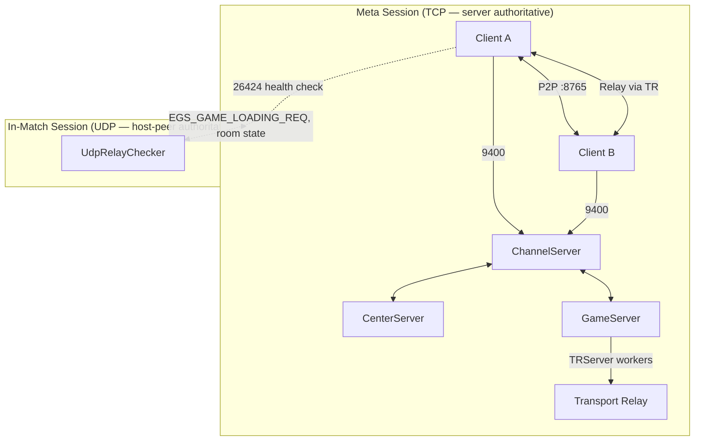
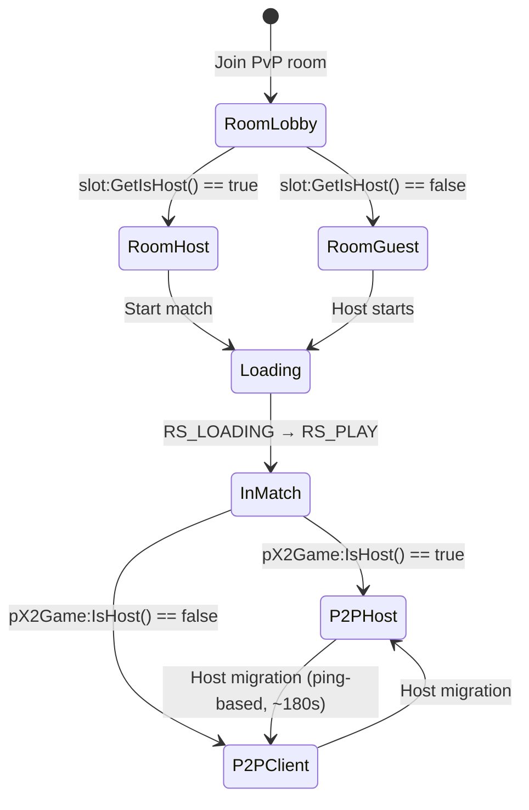

# JoySword PvP Netcode Audit — Phase 0 Investigation

**Date:** 2026-06-26  
**Scope:** PvP session networking only (not PvE, raids, combat rebalance, rendering)  
**Repository:** JoySwordOffline (`Elsword/` server pack + Lua data/scripts)

---

## Executive Summary

This repository does **not** contain the Elsword/X2 client engine (`x2.exe`) or readable C++ combat networking source. In-match PvP synchronization lives almost entirely in compiled binaries. What *is* auditable here:

| Layer | Location | Auditable? |
|-------|----------|------------|
| Lobby / room / matchmaking | GameServer + CenterServer Lua + `.exe` | Partial |
| TCP session integrity | `NetLayer:SetCheckSequenceNum` on GameServer | Yes |
| P2P / relay transport config | Lua enums + `GameSysValTable.lua` | Partial |
| In-match combat sync | `x2.exe` (not in repo) | **No — UNKNOWN** |
| State ID vocabulary | `Enum.lua` | Yes (IDs only) |

**Inferred architecture:** hybrid **host-authoritative P2P** with **UDP relay fallback**, not rollback-based fighting-game netcode.

**Modernization blocker:** Phase 1–3 code changes to packet sequencing, rollback, or deterministic combat **require client binary access** (source or RE + hook layer). Server-side Lua can only tune meta-session policy and anti-abuse gates.

---

## Packet Topology Map



### Known Ports & Endpoints

| Port | Protocol | Evidence | Purpose |
|------|----------|----------|---------|
| 9400 | TCP | `Config.lua` | Channel server (lobby, rooms, login path) |
| 9300 | TCP | `Config.lua` | Game server account creation |
| **8765** | UDP | `GAME_P2P_PORT` in `Enum.lua` | Direct P2P game traffic |
| **26424** | UDP | `UdpRelayCheckerConfig.lua` | Relay health checker (disabled by default) |

### Connection Modes (client debug API)

From `GameEditCommandList.lua` → `g_pMain:SwitchConnect_LUA(mode)`:

| Mode | Value | Behavior |
|------|-------|----------|
| Default | 0 | Auto (P2P with relay fallback — **exact heuristic UNKNOWN**) |
| Force P2P | 1 | Direct peer UDP |
| Force relay | 2 | TRServer-mediated relay |

### Packet Namespace Convention (inferred, not opcode tables)

| Prefix | Direction | Examples found in Lua |
|--------|-----------|----------------------|
| `EGS_*` | Client ↔ GameServer | `EGS_CHANGE_SLOT_OPEN_REQ`, `EGS_GAME_LOADING_REQ`, `EGS_ADMIN_*_PVP_*` |
| `ERM_*` | Relay layer | `ERM_NPC_UNIT_DIE_REQ` (host-gated, shared with dungeon) |
| `ECL_*` / `ECN_*` | Client-local | **Not found in repo** |

> **UNKNOWN:** Full opcode tables, struct layouts, P2P message IDs, serialization format.

### Debug Artifacts

Client startup deletes (evidence of client-side net logging):

- `P2PLog.txt` — P2P session log
- `State.log` — state machine log

(`Config.lua` lines 41–44)

---

## Session Ownership Rules

### Two distinct "host" concepts



| Role | API | Authority |
|------|-----|-----------|
| **Room host** | `slot:GetIsHost()` | Lobby: map, slots, start, kill/time settings |
| **P2P host** | `pX2Game:IsHost()` | In-match: NPC spawn/die, relay-gated events, likely combat arbitration |

Evidence: `DLG_PVP_Room_Lua_Func.lua` (room state), hundreds of `if pX2Game:IsHost()` gates in NPC scripts.

### Host Migration Policy

From `GameSysValTable.lua`:

```lua
GameSysVal:SetCheckChangeHostTime( 180 )  -- ~3 min ping evaluation cycle
GameSysVal:SetMaxPingScore( 5000 )        -- hysteresis: don't migrate if current host ping < 5000
GameSysVal:SetHostCheckTerm( 3.0 )        -- ERM_NPC_UNIT_DIE_REQ host validation interval
```

Debug override: `/forcehost 0|1` → `ForceHost_LUA()` (internal QA only).

**Authority drift vector:** host migration mid-match can reassign simulation ownership without visible rollback — **UNKNOWN** how state is transferred.

---

## Synchronization State Graph

### Room / Slot Lifecycle

```
ROOM_STATE:  RS_INIT → RS_CLOSED → RS_WAIT → RS_LOADING → RS_PLAY
SLOT_STATE:  SS_EMPTY → SS_CLOSE → SS_WAIT → SS_LOADING → SS_PLAY
GAME_TYPE:   GT_PVP = 1
```

### PvP Mode Types

```
PVP_GAME_TYPE:
  PGT_TEAM        = 0   (team match)
  PGT_TEAM_DEATH  = 1   (team deathmatch)
  PGT_SURVIVAL    = 2   (free-for-all)
  PGT_TAG         = 3   (tag mode)
```

### Movement Sync Vocabulary (`SYNC_UNIT_STATE`)

Compact locomotion IDs replicated between peers:

| ID | Name | Semantics |
|----|------|-----------|
| 1 | `SUS_W` | Wait/idle |
| 2 | `SUS_L` | Walk left |
| 3 | `SUS_R` | Walk right |
| 4–5 | `SUS_DL/DR` | Dash left/right |
| 11–18 | `SUS_DJL`…`SUS_JD` | Dash-jump, jump up/down, landing variants |

> **UNKNOWN:** Packet frequency, interpolation, prediction, or whether position is sent separately.

### Combat State Vocabulary (`USER_STATE_ID`)

Full animation/combat state machine IDs — hundreds of entries including:

- Locomotion: `USI_WAIT`, `USI_WALK`, `USI_DASH`, `USI_DASH_JUMP`, …
- Damage reactions: `USI_DAMAGE_SMALL_FRONT`, `USI_DAMAGE_AIR_UP`, `USI_DAMAGE_DOWN_FRONT`, …
- Skills: `USI_SPECIAL_ATTACK_1`…`4`, hyper variants, slot B variants
- Match flow: `USI_START`, `USI_START_INTRUDE`, `USI_WIN`, `USI_LOSE`
- Per-class combo states: `CSI_COMBO_Z`, `CSI_COMBO_ZZZX_FINISH`, … (extends past `USI_END`)

Sync model appears to be **state/event replication** (broadcast state transitions), not input replay.

### Hit Presentation (`HIT_TYPE` / `HITTED_TYPE`)

41 hit VFX/sound categories — presentation layer, **not** network opcodes.

---

## Investigation Receipts by Topic

| Topic | Finding | Confidence |
|-------|---------|------------|
| PvP packet flow (in-match) | UDP P2P :8765 or TR relay; debug logs `P2PLog.txt` | Medium |
| Session ownership | Dual host model; P2P host = sim authority | High |
| Authority drift | Host migration every 180s; no rollback evidence | Medium |
| Animation sync | `USER_STATE_ID` enum; implementation in `x2.exe` | Low detail |
| Combo-state sync | `CSI_*` / `ESSI_*` combo IDs exist; net path **UNKNOWN** | Low |
| Hit-confirm timing | **UNKNOWN** — no handlers in repo | — |
| Disconnect handling | `SetServerTimeOut(20)`, zombie tick 300s, LanBug disconnect (commented) | Partial |
| Packet resend | **UNKNOWN** — not found | — |
| Skill-state replication | State IDs exist; protocol **UNKNOWN** | — |
| Movement prediction | **UNKNOWN** — not found | — |
| Latency compensation | Ping-based host selection only | Partial |
| Anti-cheat boundaries | LanBug (relay timing), nProtect/XTrap on TCP, deserialize fail kick | Partial |
| Host/client trust | Host peer trusted for `ERM_*` and NPC logic; server validates meta only | High |

---

## Rollback Feasibility Report

### Current System Profile

- **Not** GGPO/rollback-style — zero references to rollback, input history, or frame buffer in entire repo
- **Likely** late-state broadcast with local prediction (**UNKNOWN** extent)
- Host migration without documented state snapshot protocol

### Full Input Rollback (GGPO-class)

| Requirement | Status |
|-------------|--------|
| Deterministic combat sim | **Not present** — floats, Lua hooks, particle RNG |
| Input capture per frame | **UNKNOWN** — no input log API |
| Save/restore game state | **UNKNOWN** |
| Client source access | **Blocked** — `x2.exe` not in repo |

**Verdict:** Full fighting-game rollback is **not feasible** without multi-year engine rewrite or complete client source.

### Bounded State Reconciliation (recommended investigation path)

| Approach | Feasibility | Feel preservation |
|----------|-------------|-------------------|
| Snapshot diff + rewind last N frames | Medium (needs RE/hook) | High if N is small (3–8 frames) |
| Input delay + lockstep (2–4 frame) | Medium | Moderate — adds latency |
| Host snapshot authority + client blend | Low effort conceptually | Moderate — may feel MMO-ish if over-corrected |
| Server-side hit validation only | High for offline LAN | Low — changes hit feel |

**Recommended bound:** 3–6 frames (~50–100ms at 60fps) rollback window for position + facing only; defer hit re-simulation until deterministic subset is identified.

---

## Deterministic Simulation Risk Report

### High Risk (likely non-deterministic today)

1. **Floating-point physics** — jump arcs, knockback, wall collision
2. **Frame-dependent Lua** — `LUA_FRAME_MOVE_FUNC` in skills/NPCs (PvP uses same engine)
3. **Per-client timing** — `GetFrameCount()` driven state transitions
4. **Massive state space** — 100+ base states × per-class combo extensions
5. **Host-only branches** — `IsHost()` gates may cause divergent code paths if mis-migrated
6. **Projectile / hitbox timing** — **UNKNOWN** whether evaluated on host only

### Medium Risk

1. Host migration handoff
2. Relay vs P2P timing differences (packet arrival order)
3. Intrude (`USI_START_INTRUDE`) mid-match join state

### Lower Risk (likely deterministic enough)

1. `SYNC_UNIT_STATE` discrete locomotion enum
2. Match outcome / kill count (server-side `PvpMatchResultTable.lua`)
3. Room state machine transitions

---

## Known Desync Vectors

| Vector | Mechanism | Evidence |
|--------|-----------|----------|
| **Phantom hits** | Hit confirmed on attacker client before host validates | Inferred from host-authoritative P2P model |
| **Teleport desync** | Position/state divergence without reconciliation | No rollback found |
| **Invalid knockback** | Divergent damage state on peers | `USI_DAMAGE_*` replicated async |
| **Combo divergence** | Combo state (`CSI_*`) desync between peers | Enum exists; sync **UNKNOWN** |
| **Host migration pop** | Authority switch at 180s ping check | `SetCheckChangeHostTime(180)` |
| **P2P NAT failure** | Fallback to relay changes latency profile | `SwitchConnect_LUA` modes |
| **Intrude join** | Mid-match entrant gets `USI_START_INTRUDE` | Enum comment |
| **Lag switch** | Delayed sync packets via relay abuse | `SERV_FIX_SYNC_PACKET_USING_RELAY` / LanBug |

---

## Known Exploit Vectors

| Vector | Mitigation in repo | Current config |
|--------|-------------------|----------------|
| Lag switch (랜선렉) | LanBug check/verify via relay timing | **Disabled** (`bLanBugOutCheck = False`) |
| Sync packet abuse | `SetLanBugOutJustLog(True)` — log only | Active (no kick) |
| TCP packet spam | `SetPacketAuthFailLimit(100)` | Active on GameServer |
| Deserialize tampering | `SetDeserializeFailCheck(True)`, count 5 | Active |
| Hack tools | XTrap, nProtect flags | XTrap enabled in test config |
| Force host | `/forcehost` debug command | QA builds only (assumed) |
| In-match combat cheat | **No server validation** | Meta-only authority |

---

## Anti-Cheat Interaction Boundaries

```
┌─────────────────────────────────────────────────────────┐
│  TCP Path (Channel/Game Server)                       │
│  ✓ Sequence numbers (GS only)                         │
│  ✓ Packet auth fail limit                             │
│  ✓ Deserialize fail kick                              │
│  ✓ XTrap / billing / hack monitoring                  │
├─────────────────────────────────────────────────────────┤
│  UDP P2P/Relay Path (In-Match)                        │
│  ? LanBug relay timing (disabled)                     │
│  ? Host packet validation (ERM_NPC_UNIT_DIE_REQ term)  │
│  ✗ No sequence check found for P2P                    │
│  ✗ No server-side hit validation found                │
└─────────────────────────────────────────────────────────┘
```

---

## Phase Roadmap (Repo-Constrained)

### Phase 1 — Stabilization (achievable now)

**Server/Lua (no client source):**

- [ ] Enable LanBug logging analysis pipeline (already `SetLanBugOutJustLog(True)`)
- [ ] Document host migration tuning knobs
- [ ] Zombie user cleanup audit (`SetZUTickTime(300)`)
- [ ] Packet capture tooling (`scripts/pvp-netcode-capture.py`)

**Requires client access:**

- [ ] P2P packet sequencing
- [ ] Heartbeat / session timeout on UDP path
- [ ] Sync diagnostics in `P2PLog.txt` / `State.log` format spec

### Phase 2 — Deterministic Combat Layer

**Blocked** until `x2.exe` strings/packets are mapped via RE or source obtained.

### Phase 3 — Modern Session Authority

- TRServer relay already exists — extend for mandatory LAN tournament relay
- Session validation requires hooking client connect handshake

---

## Key File Index

| File | Relevance |
|------|-----------|
| `Elsword/ClientScript/Major/Enum.lua` | `GAME_P2P_PORT`, `SYNC_UNIT_STATE`, `USER_STATE_ID`, room enums |
| `Elsword/ServerResource/GameSysValTable.lua` | Host migration, LanBug, `SetHostCheckTerm` |
| `Elsword/ClientScript/Major/GameEditCommandList.lua` | `/forcehost`, `/switchconnect` |
| `Elsword/GameServer/config_gs_US_TEST.lua` | `TRServer`, `NetLayer` sequence check |
| `Elsword/ServerResource/UdpRelayCheckerConfig.lua` | Relay health on :26424 |
| `Elsword/ServerResource/PvpMatchData.lua` | Matchmaking (not combat sync) |
| `Elsword/ClientScript/Dialog/DLG_PVP_Room_Lua_Func.lua` | Room UI state machine |
| `Elsword/CenterServer/config_cn_US_TEST.lua` | `RoomManager` PvP room pool |

---

## Validation Test Plan (Manual — requires 2 clients + Wireshark)

1. **Baseline capture:** 1v1 PvP, default connect, record UDP :8765 for full match
2. **Force P2P:** `/switchconnect 1`, repeat capture
3. **Force relay:** `/switchconnect 2`, compare latency distribution
4. **Host migration:** Play >3 min, log host changes in `P2PLog.txt`
5. **Desync repro:** Intentionally throttle one peer (clumsy/LANem) — document visual vs logical state
6. **Disconnect:** Kill client mid-match — observe room zombie tick behavior (300s)

---

## Migration Receipts

| Item | Status |
|------|--------|
| Packet topology map | ✅ This document |
| Synchronization state graph | ✅ This document |
| Rollback feasibility | ✅ Not feasible without client source |
| Deterministic sim risk | ✅ High risk documented |
| Desync vectors | ✅ Inferred from architecture |
| Exploit vectors | ✅ From `GameSysValTable` + config |
| Opcode tables | ❌ UNKNOWN |
| P2P handler implementation | ❌ UNKNOWN (`x2.exe`) |
| Phase 1 code changes | ⏳ Server-side only; client blocked |

---

*All behavior marked UNKNOWN was not found in this repository and must not be assumed.*
